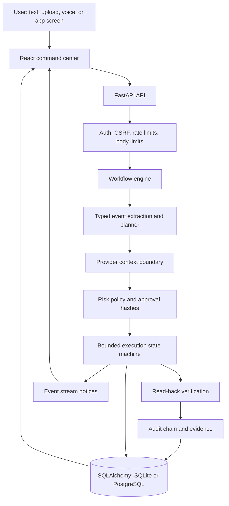
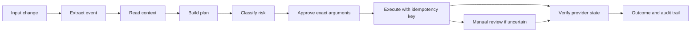

# LIFEOS Architecture

LIFEOS is a consequence-management workspace. A person describes a real change, LIFEOS gathers trusted context from connected applications, builds an approval-bound action graph, executes only approved actions, and reads providers back before marking work complete.

## System Map

## Frontend

- React, TypeScript and Vite power the main command center and the desktop companion UI.
- The main app renders event intake, consequence graphs, approval controls, audit history, connected app panels, source monitoring, privacy controls and saved work.
- API calls are centralized in `frontend/src/api.ts`, include same-origin credentials, and attach the CSRF token on mutations.
- The UI refreshes event state through polling and a server-sent event stream for active event updates.
- The desktop shell hosts real Discord and WhatsApp web sessions in isolated Electron views and sends bridge results back to the backend.

## Backend

- FastAPI exposes `/api/*` routes, `/health`, `/ready` and the static frontend fallback.
- `Security` owns session lookup, password verification, rate limiting, CSRF checks and primary-owner enforcement.
- `Engine` owns planning, approval invalidation, execution, compensation, read-back reconciliation and event change notices.
- `LiveProviders` contains Google, Discord and WhatsApp integrations behind a provider boundary.
- `Database` persists JSON documents with owner and kind indexes, schema revision checks and audit-chain append logic.

## Workflow Lifecycle

## AI Boundary

AI helps interpret natural-language event descriptions in live mode when deterministic extraction is not enough. Model output is not executable authority. The backend re-parses and validates supported event shapes, builds its own actions, binds approvals to exact arguments, and blocks arbitrary tools or recipients.

## Data Model

LIFEOS uses one versioned document table with `owner`, `kind`, `id`, `data`, `created` and `revision`. Current document kinds include events, audit entries, sessions, settings, provider tokens, integration checks, app records and work records. This keeps the product compact while preserving owner isolation and indexed owner/kind queries.

## Security Controls

- HttpOnly, SameSite session cookie.
- CSRF token required for mutations.
- Origin checks for browser commands.
- Password hash support for optional secondary accounts.
- Primary-owner guard for live provider actions.
- Request body limits and voice admission budgets.
- Provider credential encryption when `LIFEOS_ENCRYPTION_KEY` is configured.
- Approval hashes bind exact action arguments and event version.
- Read-back verification before resolution.
- Tamper-evident audit chain.

## Deployment

The production image builds the React frontend and serves it from FastAPI on the same origin. SQLite is supported for a single-process hosted workspace; PostgreSQL is supported through Docker Compose. Current release notes document the single-worker boundary, live provider acceptance status and recovery limitations.

