<div align="center">


<br/>

[](https://git.io/typing-svg)

</div>

<p align="center">
  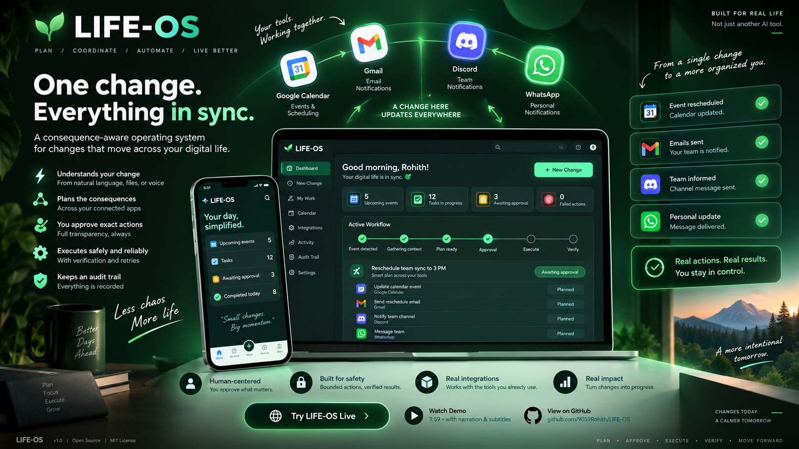
</p>

<p align="center">
  <a href="https://www.youtube.com/watch?v=efi747ciy18"><strong>Authenticated live demo</strong></a>
  &nbsp;&middot;&nbsp;
  <a href="https://lifeos-live-production.up.railway.app">🚀 <strong>Live workspace AUTH PASSWORD:REDACTED-HISTORICAL-CREDENTIAL
  &nbsp;·&nbsp;
  <a href="https://github.com/9059Rohith/LIFE-OS/blob/main/docs/demo/lifeos-demo-final.webm">🎬 <strong>Demo video (3:59)</strong></a>
  &nbsp;·&nbsp;
  <a href="ARCHITECTURE.md">🏗️ <strong>Architecture</strong></a>
  &nbsp;·&nbsp;
  <a href="SECURITY.md">🛡️ <strong>Security</strong></a>
  &nbsp;·&nbsp;
  <a href="https://github.com/9059Rohith/LIFE-OS">💻 <strong>Source code</strong></a>
  &nbsp;·&nbsp;
  <a href="JUDGES.md">🧑‍⚖️ <strong>Judge guide</strong></a>
  &nbsp;·&nbsp;
  <a href="SUBMISSION.md">📋 <strong>Submission</strong></a>
</p>

<p align="center">
  
  
  
  <br/>
  
  
  
  <br/>
  
  
</p>

<div align="center">


</div>

<br/>


## 📚 Contents

<table>
<tr>
<td valign="top" width="33%">

- [✨ At a glance](#-at-a-glance)
- [⏱️ Evaluate it in 3 minutes](#️-evaluate-it-in-3-minutes)
- [🎯 Why LIFE-OS exists](#-why-life-os-exists)
- [🔄 The core workflow](#-the-core-workflow)
- [🧩 A worked example](#-a-worked-example)
- [🖼️ Product tour](#️-product-tour)
- [🎬 Demo](#-demo)
- [🧭 Design principles](#-design-principles)

</td>
<td valign="top" width="33%">

- [✅ What is implemented](#-what-is-implemented)
- [⚙️ How the system works](#️-how-the-system-works)
- [🏛️ Architecture](#️-architecture)
- [🤖 AI and agent boundary](#-ai-and-agent-boundary)
- [🔏 Approval integrity](#-approval-integrity)
- [♻️ Reliability and failure handling](#️-reliability-and-failure-handling)
- [🔐 Security model](#-security-model)
- [🔌 Integrations](#-integrations)

</td>
<td valign="top" width="33%">

- [🧱 Technology stack](#-technology-stack)
- [⚡ Quick start](#-quick-start)
- [🛠️ Configuration](#️-configuration)
- [🧪 Testing and verification](#-testing-and-verification)
- [🚢 Deployment](#-deployment)
- [🗺️ Repository map](#️-repository-map)
- [🏆 Hackathon fit](#-hackathon-fit-next-gen-productivity-and-automation)
- [📊 How LIFE-OS compares](#-how-life-os-compares)
- [🧭 Limitations and next steps](#-limitations-and-next-steps)
- [❓ FAQ](#-faq)
- [📖 Documentation](#-documentation)
- [🤝 Contributing](#-contributing)
- [📄 License](#-license)

</td>
</tr>
</table>


## ✨ At a glance

> 🧠 LIFE-OS turns a real-world change into a structured, approval-bound workflow across the applications that need to respond. It gathers context, builds an action graph, waits for human approval, executes bounded provider actions, verifies the result by reading providers back, and preserves the evidence in an audit trail.

| | |
| --- | --- |
| 🧩 **The problem** | One schedule change quietly invalidates plans across a calendar, inboxes, and chat threads. Coordinating the fallout by hand is slow, and it is where things get missed. |
| 🛠️ **The approach** | Treat the change as a *consequence graph*. AI helps interpret the change; the server plans, validates, and executes. A human approves the exact actions. |
| 🔒 **The guarantee** | Nothing is marked done until the provider confirms it. Anything ambiguous is surfaced as *uncertain* for review instead of being reported as a success. |
| 📸 **The proof** | A live workspace, an authenticated light-mode demo with female narration and subtitles, a full screenshot tour, 141 backend tests, offline extraction evals, Playwright end-to-end tests, and a recorded Calendar → Discord → WhatsApp acceptance workflow. |

### 📈 By the numbers

<div align="center">

| Signal | Value |
| --- | --- |
| 🧪 Backend tests | **141** (see the [final release report](docs/FINAL_RELEASE_REPORT.md)) |
| 🎭 Frontend end-to-end tests | **15 passed**, 1 skipped |
| ✅ Frontend quality gates | typecheck, lint, and build all passing |
| 🔌 Integration surfaces | Google (Gmail, Calendar, Drive), Discord, WhatsApp, owner-scoped work records |
| 🎬 Demo artifact | 4:00 authenticated light-mode recording with narration and timed subtitles |
| 🛡️ Security and dependency scans | pip-audit, npm audit, secret scanning |
| 📄 License | MIT |

</div>


## ⏱️ Evaluate it in 3 minutes

1. 🟢 **Open** the [live workspace](https://lifeos-live-production.up.railway.app) and choose **Try interactive demo** for isolated sample data, or sign in for the protected owner workspace.
2. 🎥 **Watch** the [authenticated live demo](docs/demo/lifeos-authenticated-lightmode-demo-final.mp4).
3. 🔍 **Inspect** the [complete product tour](#️-product-tour), including every workspace page, the action review, verified execution, and the mobile layout.
4. 📘 **Read** the [architecture](ARCHITECTURE.md), [AI boundary](AI_USAGE.md), and [security model](SECURITY.md).
5. 🖥️ **Run** the project locally using the [quick start](#-quick-start).

### 🧭 Suggested reviewer path

<div align="center">

| ⏳ Time | 🎯 Do this | 💡 You will learn |
| --- | --- | --- |
| 30 seconds | Read [At a glance](#-at-a-glance) and look at the poster | What it is and why it exists |
| 3 minutes | Open the live workspace and run the interactive demo | The full loop: plan, approve, execute, verify |
| 5 minutes | Watch the demo video | The real Calendar, Discord, and WhatsApp lifecycle |
| 10 minutes | Read [AI and agent boundary](#-ai-and-agent-boundary) and [Security model](#-security-model) | Why it is safe to let this near real accounts |
| 30 minutes | Run it locally and execute `python -m pytest -q` | That the claims are backed by code and tests |

</div>


## 🎯 Why LIFE-OS exists

A meeting moves. That single fact needs to reach the calendar, the people who were invited, the chat channel where the team coordinates, and sometimes a messaging thread outside work. Every one of those updates is small. Together they are tedious, easy to forget, and expensive to get wrong.

The tools available today force an awkward choice:

- 🤖➡️📏 **Rule-based automation** only handles the workflows someone predefined. It cannot reason about a change it was never configured for, and it has no notion of consequences spreading across applications.
- 🧠➡️⚠️ **Autonomous AI agents** can interpret anything, but handing an open-ended agent write access to your calendar, email, and messaging accounts is a trust problem. When it acts, you cannot easily tell what it did, whether it worked, or who authorized it.

LIFE-OS takes a **third path**. It keeps the flexibility of AI for *understanding* a change, and puts everything that *acts* behind deterministic planning, explicit human approval, bounded execution, and independent verification.

> 💬 **The product is deliberately narrower than a general autonomous office agent.** Its strength is a controlled, demonstrable workflow for schedule changes and their cross-application consequences.


## 🔄 The core workflow

```text
🗣️  Change detected
      |
      v
🌐  Context gathered from authorized providers
      |
      v
🧬  Typed consequence plan and dependency graph
      |
      v
👤  Human reviews exact actions and arguments
      |
      v
⚙️  Bounded execution with idempotency and retries
      |
      v
✅  Provider read-back, evidence, and audit history
```

The same loop, shown as an interaction between the parts of the system:

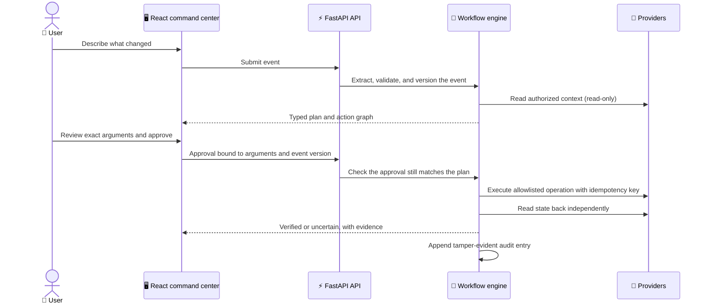


## 🧩 A worked example

> *Illustrative scenario. The steps below follow the real product flow shown in the [product tour](#️-product-tour).*

### 💬 "The design review moved from Thursday 3 PM to Friday 11 AM."

| Step | What LIFE-OS does | What you see |
| --- | --- | --- |
| 🧠 **Understand** | Extracts the event, the new date, and the new time. The server re-parses and validates the result before trusting it. | A structured event with its version. |
| 🌐 **Gather context** | Reads only authorized, relevant context from connected providers. Provider output is treated as untrusted data. | Related calendar entries and channel or thread context. |
| 🧬 **Plan** | Builds typed actions and dependencies: the calendar change, then the notifications that announce it, each with a risk label. | A consequence graph and a review queue. |
| ✍️ **Approve** | Shows the exact arguments of each action. Approval is bound to those arguments and the event version. | A review dialog. Editing any action invalidates its approval. |
| ⚙️ **Execute** | Runs allowlisted provider operations with idempotency keys, owner locks, preflight checks, and bounded retries. | Live per-action status. |
| ✅ **Verify** | Reads provider state back independently. Only then is an action marked verified. | Receipts, evidence, and an audit entry. |

> ⚠️ If any delivery cannot be confirmed, it is shown as **uncertain** and routed to manual review. It is **never** silently reported as a success.


## 🖼️ Product tour

These captures were taken from the current UI release and cover the complete demo lifecycle and every primary workspace page.

### 🎞️ The lifecycle: from change to verified result

<table>
  <tr>
    <td align="center">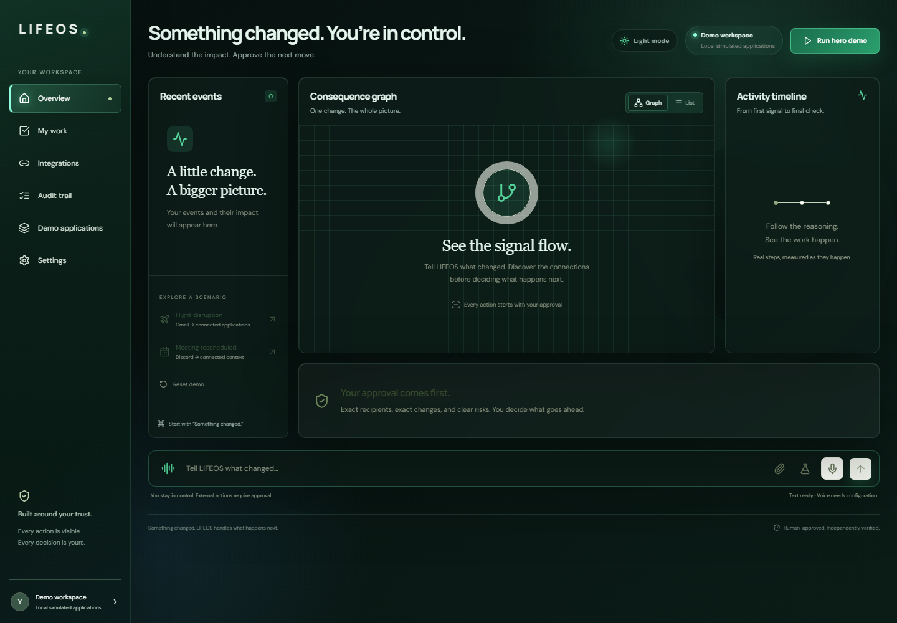<br /><sub>🪟 <b>1. Overview.</b> A clean command center before any change is submitted.</sub></td>
    <td align="center">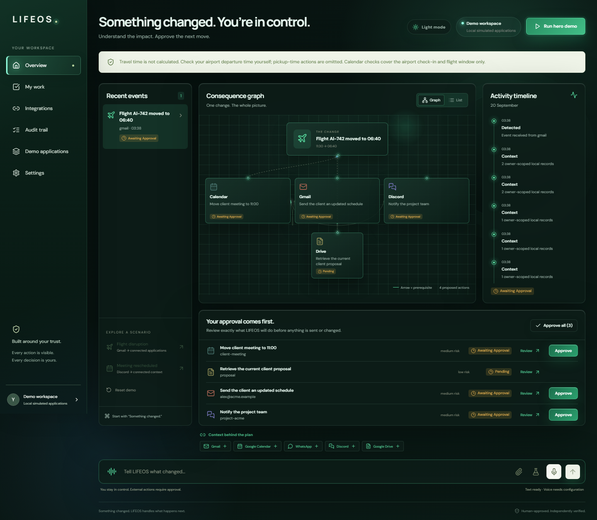<br /><sub>🧬 <b>2. Consequence plan.</b> The change becomes a typed action graph with dependencies and risk labels.</sub></td>
  </tr>
  <tr>
    <td align="center">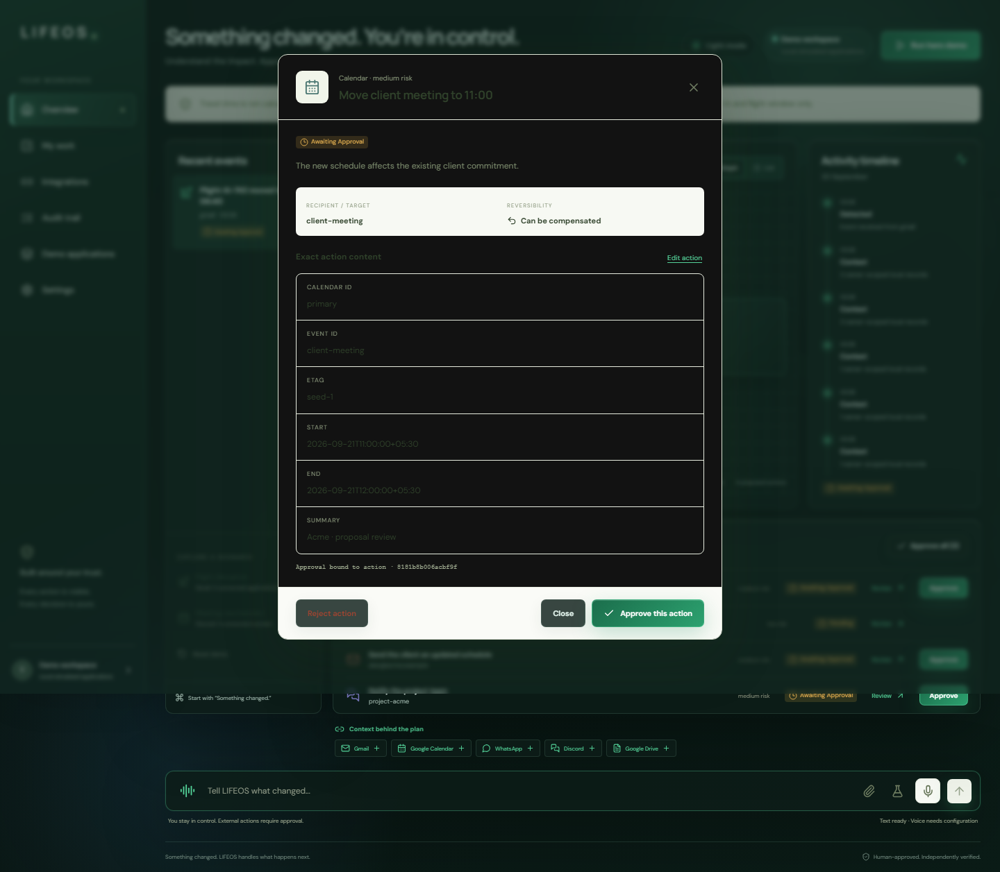<br /><sub>🔍 <b>3. Exact action review.</b> The human sees and approves the precise arguments that will run.</sub></td>
    <td align="center">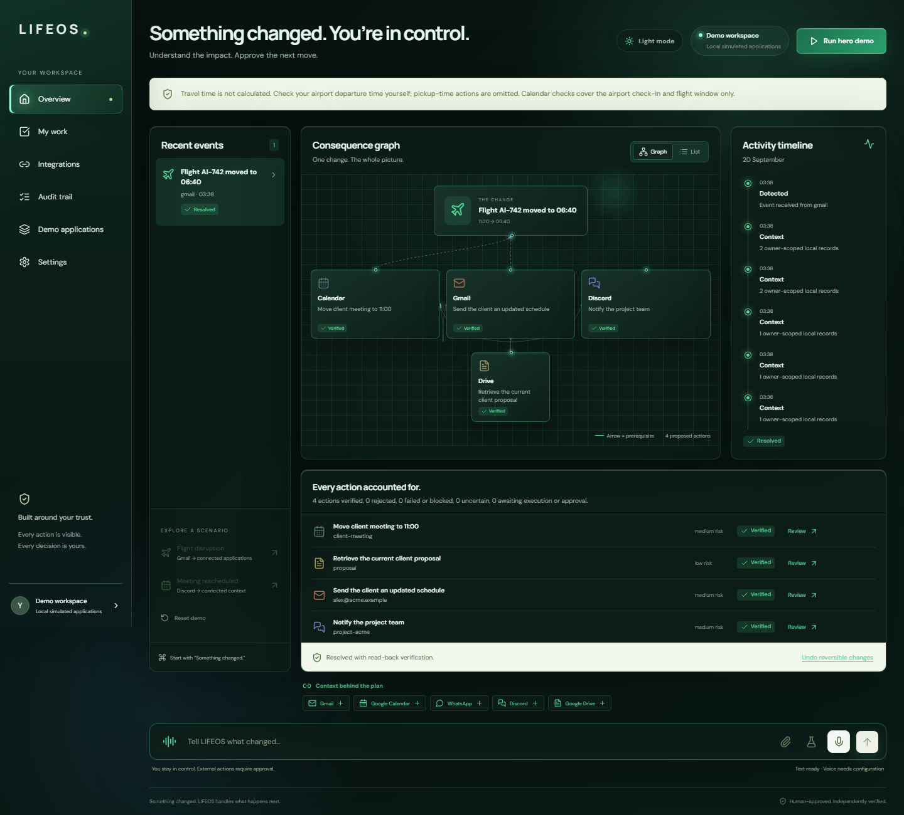<br /><sub>✅ <b>4. Verified result.</b> Each action is confirmed by reading the provider back.</sub></td>
  </tr>
  <tr>
    <td align="center"><br /><sub>🏁 <b>5. Completed overview.</b> The finished workflow with its outcome and evidence.</sub></td>
    <td align="center">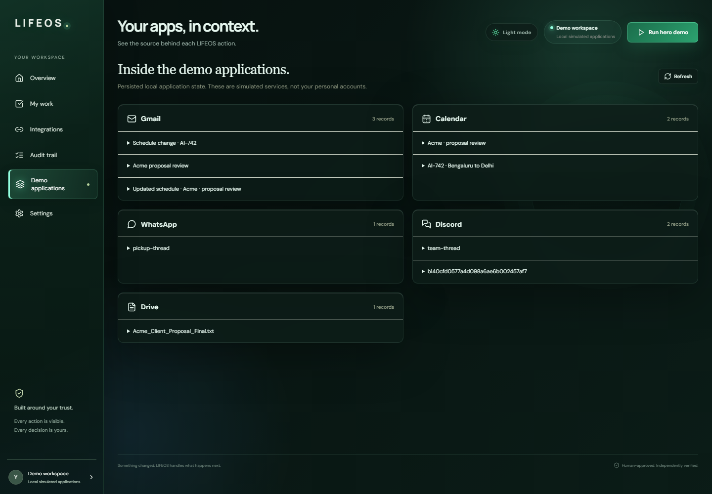<br /><sub>🗂️ <b>6. Application records.</b> The downstream application state after execution.</sub></td>
  </tr>
</table>

### 🧭 The workspace: every primary page

<table>
  <tr>
    <td align="center">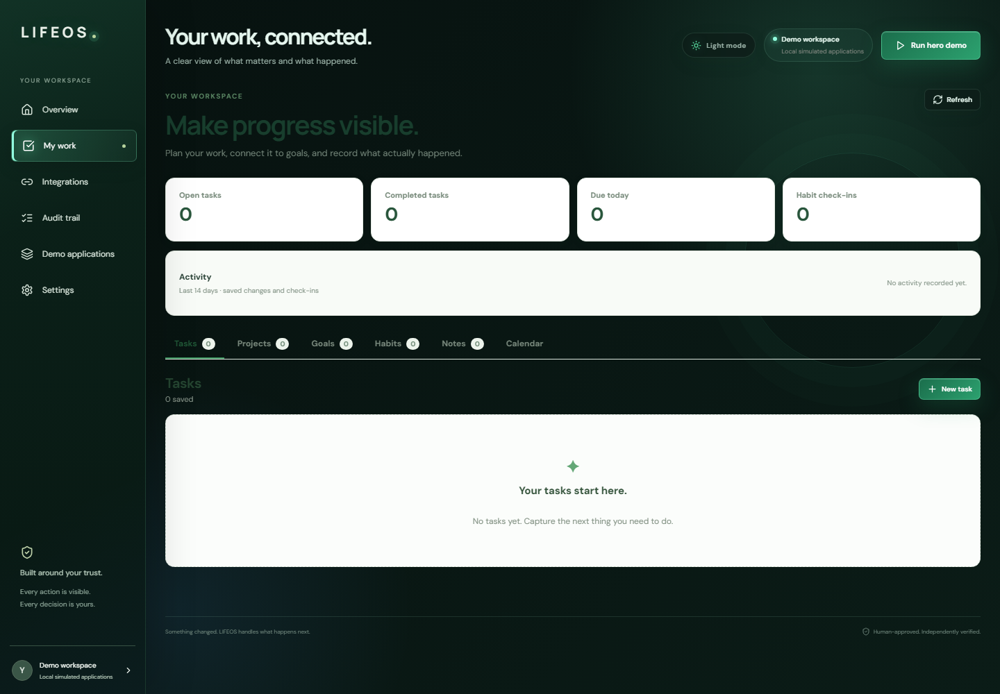<br /><sub>📋 <b>My Work.</b> Projects, goals, tasks, habits, notes, reminders, and activity history.</sub></td>
    <td align="center">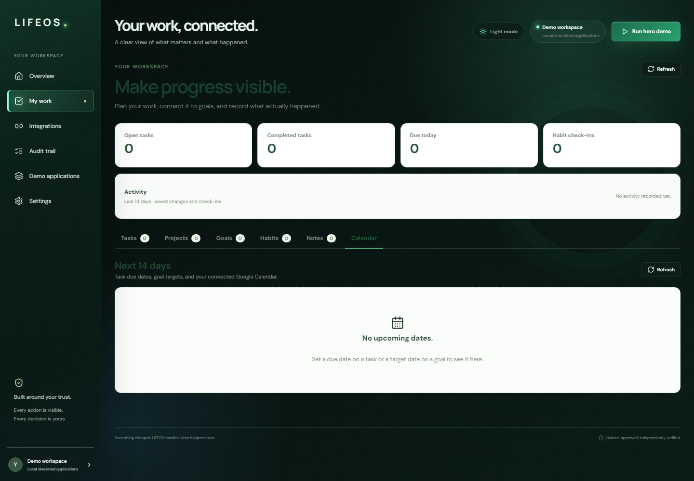<br /><sub>📅 <b>Calendar.</b> Events and availability, the source of most consequence plans.</sub></td>
  </tr>
  <tr>
    <td align="center">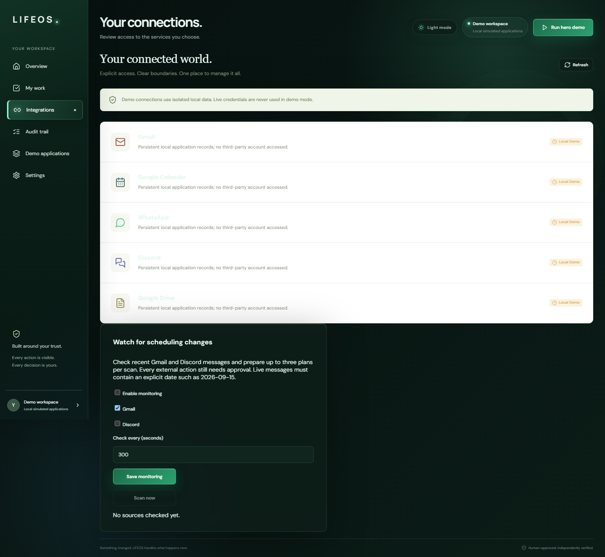<br /><sub>🔌 <b>Integrations.</b> Honest connection state for every provider.</sub></td>
    <td align="center">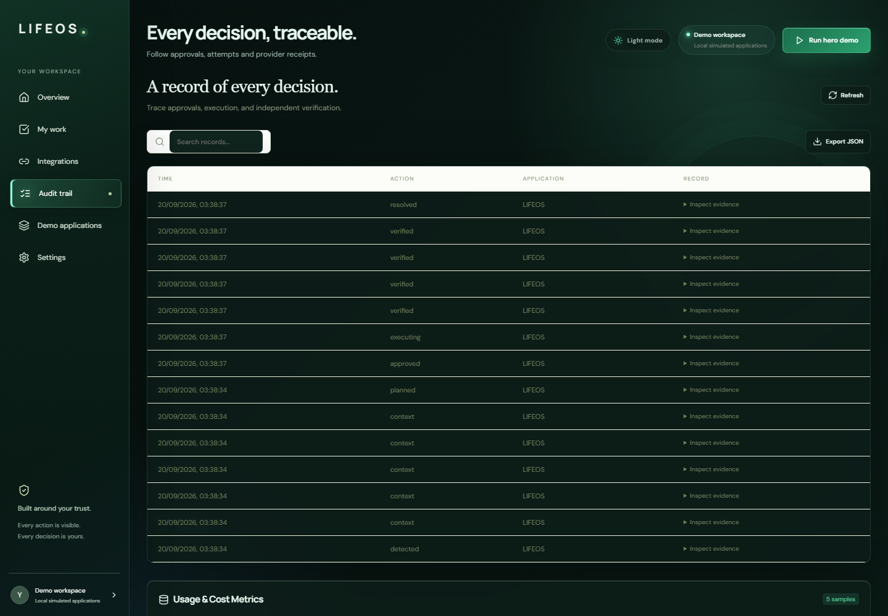<br /><sub>🧾 <b>Audit trail.</b> Tamper-evident history with inspectable evidence.</sub></td>
  </tr>
  <tr>
    <td align="center">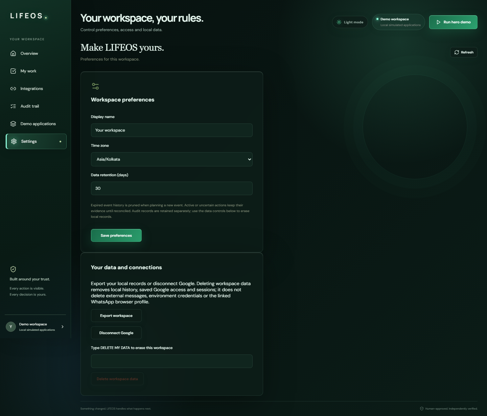<br /><sub>⚙️ <b>Settings.</b> Workspace preferences and controls.</sub></td>
    <td align="center">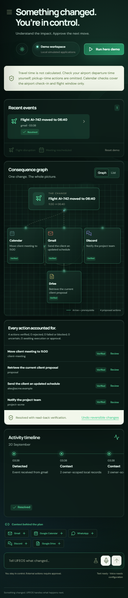<br /><sub>📱 <b>Mobile.</b> The same command center, responsive on a phone-sized screen.</sub></td>
  </tr>
</table>


## 🎬 Demo

The repository contains the original 3:59 artifact and the current authenticated 4:00 live-site demo with video, female narration, and timed subtitles:

The current submission recording is the authenticated light-mode walkthrough. It shows the real Connected Apps interface for Gmail, Google Calendar, Discord, WhatsApp, and Drive, then tours the workflow, review, execution, My Work, Integrations, Audit Trail, and Settings pages with continuous female narration and animated-fade subtitles.

- [Watch or download the authenticated live demo](docs/demo/lifeos-authenticated-lightmode-demo-final.mp4)
- [Read the authenticated demo script](docs/demo/lifeos-authenticated-lightmode-demo-script.md)
- [Read the subtitle track](docs/demo/lifeos-authenticated-lightmode-demo.srt)

The recording is read-only: sensitive provider content is redacted in the video, and no external message, calendar event, or account setting is changed during capture.

- 🎥 [Watch or download lifeos-demo-final.webm](docs/demo/lifeos-demo-final.webm)
- 📝 [Read the demo script](docs/demo-script.md)
- 💬 [Read the subtitle track](docs/demo/lifeos-demo.srt)
- 🎙️ [Read the voiceover text](docs/demo/lifeos-demo-voiceover.txt)

> 📌 The GitHub-hosted file is the verified repository artifact. If a submission form requires a streaming-host URL, upload this same file to the permitted host rather than inventing a link.


## 🧭 Design principles

These are the rules the rest of the system is built to enforce.

| # | Principle | What it means in practice |
| --- | --- | --- |
| 1️⃣ | 🧠 **AI proposes. The server decides.** | AI output is never executable authority. The server re-parses, validates, and constructs the actions itself. |
| 2️⃣ | 🔏 **Approval binds to exact content.** | Approvals are tied to an action's arguments and the event version, so a changed plan cannot reuse an earlier approval. |
| 3️⃣ | ✅ **Verified beats assumed.** | An action is only verified after an independent provider read-back. A successful API response is not enough. |
| 4️⃣ | ❓ **Uncertainty is a first-class state.** | Crashes and ambiguous deliveries become explicit *uncertain* states that require review, never optimistic successes. |
| 5️⃣ | 🚫 **Provider output is untrusted.** | Content read from providers is context for planning. It is never permission to act. |
| 6️⃣ | 🧱 **Bounded by construction.** | Only allowlisted provider operations exist. There is no arbitrary tool access. |
| 7️⃣ | 🗣️ **Honest about limits.** | Unavailable integrations are reported as unavailable, and known boundaries are documented rather than hidden. |


## ✅ What is implemented

| Area | Capabilities |
| --- | --- |
| 📥 **Intake** | Natural-language event intake through text, upload, voice, or connected application screens. Deterministic event extraction, with constrained OpenAI-compatible structured extraction when live mode needs help. |
| 🌐 **Context** | Context gathering from Google services, Discord, WhatsApp, and stored work records behind provider boundaries. |
| 🧬 **Planning** | A consequence graph showing dependencies, action status, approval requirements, and execution progress. |
| ✍️ **Approval** | Approval-bound actions whose exact arguments and event version are hashed. Editing an action invalidates its approval. |
| ⚙️ **Execution** | Bounded execution with owner locks, idempotency keys, provider preflight checks, retries, compensation, and explicit uncertain states. |
| 🔍 **Verification** | Independent provider read-back before an action is marked verified. |
| 🧾 **Audit** | Tamper-evident audit entries with inspectable evidence. |
| 📋 **My Work** | Projects, goals, tasks, habits, notes, reminders, agenda items, and activity history. |
| 🖥️ **Clients** | Responsive React web UI, plus a Windows Electron companion for real Discord and WhatsApp web sessions. |
| 🌗 **Experience** | Light and dark UI modes with motion-aware workflow visualization. |


## ⚙️ How the system works

### 1️⃣ 🧠 Understand

The user describes what changed. LIFE-OS accepts a narrow set of supported event shapes and uses AI only as a structured interpretation aid when deterministic parsing is insufficient.

### 2️⃣ 🌐 Gather context

The provider boundary reads only authorized, relevant information. Provider output is treated as untrusted context, not as permission to act.

### 3️⃣ 🧬 Plan

The engine creates typed actions, dependencies, risk labels, approval requirements, and an event version. The frontend renders this as a graph and review queue.

### 4️⃣ ✍️ Approve

The person reviews action arguments. Approvals are bound to the event version and argument hash, so a changed plan cannot reuse an earlier approval.

### 5️⃣ ⚙️ Execute

The engine uses allowlisted provider operations, idempotency keys, bounded retries, owner locking, and explicit failure states. High-impact actions remain approval-gated.

### 6️⃣ ✅ Verify

LIFE-OS reads provider state back independently. The final outcome, receipts, uncertain deliveries, compensation attempts, and audit history remain visible.

### 🔁 Action lifecycle

> *Conceptual view of how an action moves through the engine.*

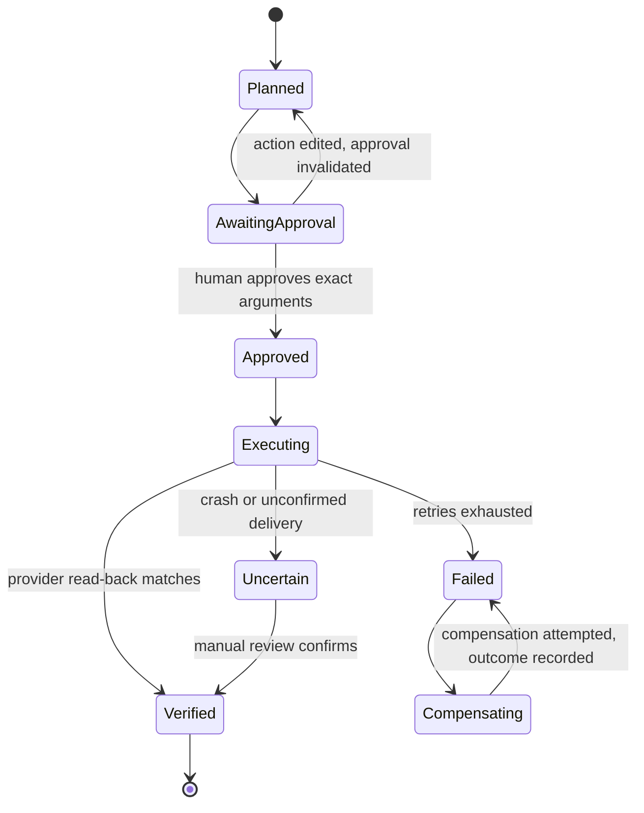


## 🏛️ Architecture

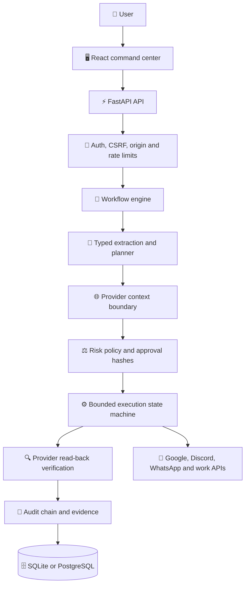

The production image builds the React frontend and serves it from FastAPI on the same origin. SQLite supports a single-process hosted workspace; PostgreSQL is supported through Docker Compose. See [ARCHITECTURE.md](ARCHITECTURE.md).

### 🧩 Key components

| Component | Responsibility |
| --- | --- |
| 🖥️ **React command center** | Event intake, consequence graph, action review, workspace pages, and audit views. |
| ⚡ **FastAPI API** | Authenticated routes, request validation, CSRF and origin checks, rate limits, and health endpoints. |
| 🧠 **Workflow engine** | Typed extraction, planning, risk policy, approval state machine, and idempotent execution. |
| 🌐 **Provider boundary** | Owner-scoped, allowlisted adapters for Google, Discord, WhatsApp, and work records. |
| 🔍 **Verification layer** | Independent provider read-back that decides whether an action is truly done. |
| 🧾 **Audit chain** | Tamper-evident history with inspectable evidence for every meaningful step. |
| 🖥️ **Desktop companion** | Electron app with isolated Discord and WhatsApp views and a signed-in bridge queue. |


## 🤖 AI and agent boundary

LIFE-OS is **not** a general-purpose agent with arbitrary tool access. That is deliberate.

AI helps extract a supported event, date, and time from natural language. The server then re-parses and validates the result, constructs supported actions itself, checks provider permissions, and requires human approval before high-impact writes. **AI output is never executable authority.**

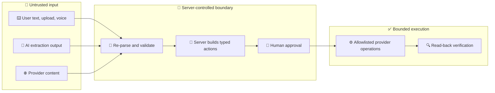

| ✅ AI can | 🚫 AI cannot |
| --- | --- |
| Help interpret a supported event, date, and time from natural language | Choose which provider operations exist |
| Assist when deterministic parsing is insufficient | Execute anything directly |
| Support optional voice services | Approve an action on a person's behalf |
| | Widen its own permissions or reach unlisted tools |

**Supported action families:**

- 📅 Calendar updates and rescheduling plans.
- 📧 Gmail notifications.
- 💬 Discord notifications.
- 📱 WhatsApp notifications through the connected desktop bridge.
- 🗂️ Explicit work-record operations.

📖 Read [AI_USAGE.md](AI_USAGE.md) for models, validation, failure handling, and limitations.


## 🔏 Approval integrity

Approval is the point where a person takes responsibility for an action, so it has to mean exactly one thing.

- 🔑 Each action carries a hash over its **exact arguments** and the **event version**.
- ✅ An approval is valid only for the hash it was granted against.
- ✏️ **Editing an action invalidates its approval**, and changing the event produces a new version, so stale approvals cannot be replayed onto a different plan.
- 🛑 High-impact writes never run without an approval that matches the current plan.

> 💚 The result: **what the reviewer saw is what executes.**


## ♻️ Reliability and failure handling

The interesting part of an automation system is what happens when things go wrong. LIFE-OS treats failure as a designed-for state.

| Situation | Behavior |
| --- | --- |
| 🔁 The same request is submitted twice | **Idempotency keys** prevent duplicate side effects. |
| ⚠️ A provider call fails transiently | **Bounded retries** are attempted, not an unbounded loop. |
| 🏎️ Two operations race on one owner's data | **Owner locks** serialize them. |
| ❌ A provider reports success but the state does not match | The action is **not marked verified**. Read-back is the source of truth. |
| 💥 The process crashes mid-execution | Recovery moves the action to **uncertain** instead of guessing. |
| 📭 A delivery cannot be confirmed | It is surfaced as **uncertain** and routed to manual review. |
| ⛓️‍💥 A later step fails after earlier steps succeeded | **Compensation** is attempted and its outcome is recorded. |
| ✏️ A person edits an action after approving it | The approval is **invalidated** and must be granted again. |
| 🔌 A provider is not connected or lacks permission | The UI reports the real state and does not present the service as connected. |

> 🧾 Every outcome, receipt, uncertain delivery, and compensation attempt remains visible in the audit trail.


## 🔐 Security model

### 🛡️ Controls

- 🍪 HttpOnly, SameSite session cookies and CSRF tokens for mutations.
- 🌐 Browser origin validation, request body limits, voice admission budgets, and rate limits.
- 👑 Primary-owner enforcement for live provider actions.
- 🔑 Password hashing for optional secondary workspaces.
- 🔒 Encrypted provider credentials when `LIFEOS_ENCRYPTION_KEY` is configured.
- ✅ Pydantic validation and explicit allowlisted provider operations.
- 🔏 Approval hashes tied to exact arguments and plan versions.
- 🔁 Idempotency keys, bounded retries, owner locks, and crash-to-uncertain recovery.
- 🔍 Read-back verification before resolution and manual review for uncertain deliveries.
- 🧾 Tamper-evident audit history and `/health` plus `/ready` endpoints.

### ⚔️ Threats and mitigations

| Threat | Mitigation |
| --- | --- |
| 🕵️ Malicious instructions hidden in provider content | Provider output is untrusted context. The server builds actions itself, so content cannot grant itself authority. |
| 🎯 Model output steering an action | AI output is re-parsed and validated. It is never executable. |
| 🌐 Cross-site request forgery | CSRF tokens on mutations, SameSite session cookies, and browser origin validation. |
| ♻️ Approval reuse after a plan changes | Approvals are bound to the argument hash and event version. |
| 👥 Duplicate or replayed side effects | Idempotency keys and owner locks. |
| 🎭 Reporting success that did not happen | Independent provider read-back and explicit uncertain states. |
| 🗝️ Credential exposure at rest | Provider credentials are encrypted when an encryption key is configured. |
| 🧾 Tampering with history | Tamper-evident audit chain. |
| 💣 Abuse and resource exhaustion | Rate limits, request body limits, and voice admission budgets. |
| 👀 Demo visitors reaching real accounts | Demo sessions are isolated and never receive live provider access. |

### 📏 Honest scope

LIFE-OS is **not** presented as a penetration-tested multi-tenant SaaS. The supported hosted boundary is primary-owner and single-worker focused. See [SECURITY.md](SECURITY.md), [docs/SECURITY.md](docs/SECURITY.md), and [docs/RELEASE_STATUS.md](docs/RELEASE_STATUS.md).


## 🔌 Integrations

| Integration | Role | Boundary |
| --- | --- | --- |
| 📧 Google Gmail | Read mail context and prepare notifications. | Owner-scoped OAuth grant and provider checks. |
| 📅 Google Calendar | Read events, check availability, and plan supported changes. | Exact-event planning, approval, idempotency, and read-back. |
| 🗄️ Google Drive | Surface authorized proposal or supporting document context. | Optional configured file access. |
| 💬 Discord | Read channel context and send approved notifications. | Configured channel allowlist and provider evidence. |
| 📱 WhatsApp | Read and send through the signed-in desktop companion. | Isolated browser view, explicit bridge job, exact-message read-back. |
| 🗂️ Work records | Persist personal work and activity. | Owner-scoped routes and deletion and export controls. |

> ℹ️ Integration availability depends on credentials, provider permissions, and whether the Windows companion is connected. The UI reports those states instead of presenting unavailable services as connected.


## 🧱 Technology stack

<div align="center">


</div>

| Layer | Implementation |
| --- | --- |
| 🖥️ Web UI | React, TypeScript, Vite, Lucide icons, responsive CSS |
| ⚡ API | Python 3.11+, FastAPI, Uvicorn, Pydantic |
| 🧠 Workflow engine | Typed event planning, approval state machine, idempotent provider execution |
| 🗄️ Persistence | SQLAlchemy-backed SQLite or PostgreSQL, startup migrations |
| 🤖 AI | OpenAI-compatible structured extraction and optional voice services |
| 🖥️ Desktop | Electron with isolated Discord and WhatsApp views plus a signed-in bridge queue |
| 🚢 Delivery | Docker, Railway configuration, same-origin static frontend serving |
| 🧪 Quality | Pytest, Playwright, ESLint, Ruff, mypy, pip-audit, npm audit, secret scanning |


## ⚡ Quick start

### 📋 Prerequisites

- 🐍 Python 3.11 or newer
- 🟩 Node.js 18 or newer
- 🔧 Git

### 1️⃣ Clone and configure

```bash
git clone https://github.com/9059Rohith/LIFE-OS.git
cd LIFE-OS
```

Create your environment file:

```bash
# Windows (cmd or PowerShell)
copy .env.example .env

# macOS or Linux
cp .env.example .env
```

Set a strong `LIFEOS_AUTH_PASSWORD`, keep `LIFEOS_MODE=live`, and use the SQLite database path from `.env.example`. Provider credentials are optional until you exercise a specific integration.

### 2️⃣ Start the API

```bash
python -m venv .venv
# activate the virtual environment for your shell, then:
python -m pip install -e ".[dev]"
python -m uvicorn lifeos.main:app --app-dir backend --host 127.0.0.1 --port 8010 --reload
```

### 3️⃣ Start the frontend

In a second terminal:

```bash
cd frontend
npm ci
LIFEOS_API_URL=http://127.0.0.1:8010 npm run dev -- --port 5173
```

On PowerShell:

```powershell
cd frontend
$env:LIFEOS_API_URL = "http://127.0.0.1:8010"
npm ci
npm run dev -- --port 5173
```

Open <http://127.0.0.1:5173> and sign in with the local workspace password.

### 4️⃣ Confirm it is healthy

| Check | Expected |
| --- | --- |
| 💓 `http://127.0.0.1:8010/health` | The API process is alive. |
| 🟢 `http://127.0.0.1:8010/ready` | The API is ready to serve requests. |
| 🖥️ `http://127.0.0.1:5173` | The React command center loads and accepts your login. |

### 🐳 Docker Compose (PostgreSQL)

PostgreSQL is supported through Docker Compose using the included `docker-compose.yml`:

```bash
docker compose up --build
```

### 🖥️ Desktop companion

The Electron companion is optional and is needed for the live WhatsApp and Discord web sessions:

```bash
cd desktop
npm ci
npm test
npm start
```

📖 Read [docs/DEPLOYMENT.md](docs/DEPLOYMENT.md) and [docs/LOCAL_LIVE.md](docs/LOCAL_LIVE.md) before connecting real provider accounts.


## 🛠️ Configuration

The complete safe template is [.env.example](.env.example). Important variables include:

| Variable | Purpose |
| --- | --- |
| 🔑 `LIFEOS_AUTH_PASSWORD` | Required protected owner-workspace login secret. |
| 🕹️ `LIFEOS_DEMO_BUTTON` | Enables the isolated demo entry button. Demo sessions never receive live provider access. |
| 🗄️ `LIFEOS_DATABASE_URL` | SQLite or PostgreSQL connection URL. |
| 🌐 `LIFEOS_ALLOWED_ORIGINS` | Browser origins allowed to call the API. |
| 🔒 `LIFEOS_ENCRYPTION_KEY` | Encrypts provider credentials at rest when configured. |
| 🤖 `LIFEOS_OPENAI_API_KEY` | Optional structured extraction and voice services. |
| 📅 `LIFEOS_GOOGLE_*` | Optional Google OAuth configuration. |
| 💬 `LIFEOS_DISCORD_*` | Optional Discord bot and destination configuration. |
| 📱 `LIFEOS_WHATSAPP_*` | Optional desktop bridge configuration. |

> 🚫 **Never commit** `.env`, tokens, provider profiles, database backups, or browser session files.


## 🧪 Testing and verification

### 📊 Current results

<div align="center">

| Suite | Result |
| --- | --- |
| 🔎 Frontend typecheck (`npm run typecheck`) | ✅ Passed |
| 🧹 Frontend lint (`npm run lint`) | ✅ Passed |
| 🏗️ Frontend build (`npm run build`) | ✅ Passed |
| 🎭 Frontend end-to-end (`npm run test:e2e`) | ✅ 15 passed, 1 skipped |
| 🧪 Backend tests | ✅ 141 passed (see the final release report) |

</div>

📄 The [final release report](docs/FINAL_RELEASE_REPORT.md) records broader release evidence, including 141 backend tests, offline extraction evals, security and dependency scans, desktop tests, Docker checks, hosted health and readiness checks, and a recorded Calendar → Discord → WhatsApp acceptance run. Hosted revision parity remains an explicit release check.

### ▶️ Run it yourself

```bash
python -m pytest -q
python -m ruff check backend tests scripts
python -m mypy --strict backend/lifeos/policy.py backend/lifeos/schemas.py backend/lifeos/config.py
npm --prefix frontend run lint
npm --prefix frontend run build
npm --prefix desktop test
python scripts/scan_secrets.py
```


## 🚢 Deployment

The current live workspace is:

<div align="center">

### 🌐 **<https://lifeos-live-production.up.railway.app>**

</div>

- 🔒 The owner workspace is password-protected.
- 🕹️ When `LIFEOS_DEMO_BUTTON=true`, visitors can enter an isolated local-data demo without credentials. That session cannot access owner records or live provider adapters.
- 💓 The container exposes `/health` and `/ready`, builds the frontend in a pinned Node stage, and serves the compiled assets from FastAPI.
- 🚂 Railway settings live in [railway.json](railway.json). Container details are in the [Dockerfile](Dockerfile).

> 📌 Deployment caveats are documented rather than hidden: the supported hosted boundary is single-worker and primary-owner focused, the Windows installer is unsigned, and managed external backup scheduling is not claimed as a universal production guarantee. See [docs/RELEASE_STATUS.md](docs/RELEASE_STATUS.md).


## 🗺️ Repository map

```text
LIFE-OS/
├── frontend/       🖥️  React command center, components, styles, Playwright tests
├── backend/        ⚡  FastAPI routes, workflow engine, providers, security, storage
├── desktop/        🖥️  Electron companion and provider bridge
├── tests/          🧪  Backend, provider, recovery, security, and integration tests
├── docs/           📖  Architecture, release evidence, screenshots, poster, demo assets
├── scripts/        🛠️  Verification, capture, recovery, packaging, and deployment helpers
├── Dockerfile      🐳  Multi-stage production image
├── docker-compose.yml
├── .env.example    🔐  Safe configuration template
├── ARCHITECTURE.md
├── AI_USAGE.md
├── SECURITY.md
└── README.md
```


## 🏆 Hackathon fit: Next-Gen Productivity and Automation

### 🎯 Track goals

| Track goal | LIFE-OS evidence |
| --- | --- |
| 🔁 Automate repetitive work | One schedule change can prepare coordinated Calendar, Gmail, Discord, and WhatsApp actions. |
| 🧵 Streamline workflows | A single reviewed plan replaces repeated context lookup, drafting, and coordination. |
| 🗂️ Organize information | Events, provider context, action evidence, work records, reminders, and audit history are surfaced together. |
| 🚀 Move people faster | The product reduces manual coordination while keeping high-impact decisions visible and human-approved. |
| 🤖 Use AI meaningfully | AI assists structured event interpretation inside a server-controlled boundary. It does not receive arbitrary execution authority. |
| 🔬 Demonstrate reliability | Approval hashes, idempotency, read-back verification, uncertain states, and audit evidence make the workflow inspectable. |

### 🏅 Against typical judging criteria

| Criterion | Where to look |
| --- | --- |
| 💡 **Innovation** | The consequence-graph model and the AI-proposes, server-decides boundary. See [AI and agent boundary](#-ai-and-agent-boundary). |
| 🔬 **Technical depth** | Approval hashing, idempotent execution, owner locks, crash-to-uncertain recovery, and read-back verification. See [Reliability and failure handling](#️-reliability-and-failure-handling). |
| 🌍 **Real-world impact** | Reduces the coordination cost of every schedule change across Calendar, Gmail, Discord, and WhatsApp. |
| 🧩 **Completeness** | Web app, desktop companion, live deployment, demo video, poster, and documentation set. |
| 🛡️ **Quality and trust** | 141 backend tests, offline extraction evals, Playwright end-to-end tests, security and dependency scans, and a documented threat model. |
| 🎨 **Presentation** | Poster, full product tour, narrated demo with subtitles, and a three-minute evaluation path. |

📖 See [docs/HACKATHON_ALIGNMENT.md](docs/HACKATHON_ALIGNMENT.md), [docs/COMPETITOR_SCORECARD.md](docs/COMPETITOR_SCORECARD.md), and [docs/PRIVACY_BOUNDARY.md](docs/PRIVACY_BOUNDARY.md).


## 📊 How LIFE-OS compares

| Capability | 📏 Rule-based automation | 🤖 Autonomous AI agent | 🟢 **LIFE-OS** |
| --- | --- | --- | --- |
| Handles changes nobody pre-configured | Limited | Yes | **Yes, within supported event shapes** |
| Reasons about cross-application consequences | No | Varies | **Yes, as a typed consequence graph** |
| Human sees exact arguments before anything runs | Rarely | Rarely | **Always for high-impact actions** |
| Approval is bound to exact content | No | No | **Yes, hashed to arguments and event version** |
| AI output can execute directly | No | Often | **Never** |
| Confirms the outcome independently | Rarely | Rarely | **Provider read-back before verified** |
| Surfaces ambiguous outcomes honestly | Rarely | Rarely | **Explicit uncertain state** |
| Auditable evidence trail | Varies | Varies | **Tamper-evident audit chain** |


## 🧭 Limitations and next steps

### ✅ Implemented and documented

- 🏠 Local live-mode workspace with owner-scoped persistence.
- 🔏 Approval-bound planning and execution lifecycle.
- 🌐 Provider context, action dependencies, read-back verification, and audit evidence.
- 🔌 Google, Discord, WhatsApp, Drive, voice, work-record, and desktop integration boundaries.
- 📱 Responsive web UI, optional dark mode, and Electron companion.
- 🧪 Automated backend, frontend, desktop, security, recovery, build, and dependency checks.

### 🚧 Boundaries to understand

- 🎯 The product is optimized for a narrow class of schedule-change and consequence workflows.
- 🔑 Provider actions require valid credentials, configured destinations, permissions, and in some cases the connected Windows companion.
- ☁️ The hosted deployment is not positioned as a horizontally scaled, multi-tenant SaaS.
- 🖊️ The Windows installer is unsigned on the current release line.
- 🎥 External submission platforms may require the repository demo video to be uploaded to a streaming host.

### 🛤️ Next steps

Directions that follow directly from the boundaries above:

- ✍️ Sign the Windows installer.
- 🏗️ Harden the hosted boundary toward horizontal scale and multi-tenant use.
- 💾 Add managed, scheduled external backups.
- 🧬 Extend supported event shapes beyond schedule changes while keeping the same approval and verification guarantees.


## ❓ FAQ

<details>
<summary>❓ <strong>Why not just use a general autonomous agent?</strong></summary>
<br/>

Open-ended agents are powerful, but giving one write access to calendar, email, and messaging is a trust problem. LIFE-OS keeps AI on the understanding side and puts every action behind server-built plans, exact-argument approval, bounded execution, and read-back verification.

</details>

<details>
<summary>❓ <strong>Can the AI send a message or change an event by itself?</strong></summary>
<br/>

**No.** AI output is never executable authority. The server constructs the actions, and high-impact writes require an approval that matches the current plan.

</details>

<details>
<summary>❓ <strong>Does it work without an OpenAI key?</strong></summary>
<br/>

**Yes**, for supported event shapes. Event extraction is deterministic first. The OpenAI-compatible key is optional and is used for constrained structured extraction and voice services when deterministic parsing is not enough.

</details>

<details>
<summary>❓ <strong>What happens if a provider is down or a delivery cannot be confirmed?</strong></summary>
<br/>

Retries are bounded. If an outcome cannot be confirmed, the action becomes an explicit **uncertain** state routed to manual review. It is never reported as verified without provider read-back.

</details>

<details>
<summary>❓ <strong>Is the live demo safe to click around in?</strong></summary>
<br/>

**Yes.** The interactive demo uses isolated sample data. Demo sessions cannot access owner records or live provider adapters.

</details>

<details>
<summary>❓ <strong>Why is the scope so narrow?</strong></summary>
<br/>

On purpose. A controlled, demonstrable workflow you can trust beats a broad one you cannot inspect. The guarantees here (approval integrity, verification, honest failure states) are the product.

</details>

<details>
<summary>❓ <strong>Why is the demo video a repository file and not a streaming link?</strong></summary>
<br/>

The repository file is the verified artifact. If a submission platform requires a streaming host, upload the same file there rather than substituting a different recording.
| Suite | Result |
| --- | --- |
| 🔎 Frontend typecheck (`npm run typecheck`) | ✅ Passed |
| 🧹 Frontend lint (`npm run lint`) | ✅ Passed |
| 🏗️ Frontend build (`npm run build`) | ✅ Passed |
| 🎭 Frontend end-to-end (`npm run test:e2e`) | ✅ 15 passed, 1 skipped |
| 🧪 Backend tests | ✅ 141 passed (see the final release report) |

</div>

📄 The [final release report](docs/FINAL_RELEASE_REPORT.md) records broader release evidence, including 141 backend tests, offline extraction evals, security and dependency scans, desktop tests, Docker checks, hosted health and readiness checks, and a recorded Calendar → Discord → WhatsApp acceptance run. Hosted revision parity remains an explicit release check.

### ▶️ Run it yourself

```bash
python -m pytest -q
python -m ruff check backend tests scripts
python -m mypy --strict backend/lifeos/policy.py backend/lifeos/schemas.py backend/lifeos/config.py
npm --prefix frontend run lint
npm --prefix frontend run build
npm --prefix desktop test
python scripts/scan_secrets.py
```


## 🚢 Deployment

The current live workspace is:

<div align="center">

### 🌐 **<https://lifeos-live-production.up.railway.app>**

</div>

- 🔒 The owner workspace is password-protected.
- 🕹️ When `LIFEOS_DEMO_BUTTON=true`, visitors can enter an isolated local-data demo without credentials. That session cannot access owner records or live provider adapters.
- 💓 The container exposes `/health` and `/ready`, builds the frontend in a pinned Node stage, and serves the compiled assets from FastAPI.
- 🚂 Railway settings live in [railway.json](railway.json). Container details are in the [Dockerfile](Dockerfile).

> 📌 Deployment caveats are documented rather than hidden: the supported hosted boundary is single-worker and primary-owner focused, the Windows installer is unsigned, and managed external backup scheduling is not claimed as a universal production guarantee. See [docs/RELEASE_STATUS.md](docs/RELEASE_STATUS.md).


## 🗺️ Repository map

```text
LIFE-OS/
├── frontend/       🖥️  React command center, components, styles, Playwright tests
├── backend/        ⚡  FastAPI routes, workflow engine, providers, security, storage
├── desktop/        🖥️  Electron companion and provider bridge
├── tests/          🧪  Backend, provider, recovery, security, and integration tests
├── docs/           📖  Architecture, release evidence, screenshots, poster, demo assets
├── scripts/        🛠️  Verification, capture, recovery, packaging, and deployment helpers
├── Dockerfile      🐳  Multi-stage production image
├── docker-compose.yml
├── .env.example    🔐  Safe configuration template
├── ARCHITECTURE.md
├── AI_USAGE.md
├── SECURITY.md
└── README.md
```


## 🏆 Hackathon fit: Next-Gen Productivity and Automation

### 🎯 Track goals

| Track goal | LIFE-OS evidence |
| --- | --- |
| 🔁 Automate repetitive work | One schedule change can prepare coordinated Calendar, Gmail, Discord, and WhatsApp actions. |
| 🧵 Streamline workflows | A single reviewed plan replaces repeated context lookup, drafting, and coordination. |
| 🗂️ Organize information | Events, provider context, action evidence, work records, reminders, and audit history are surfaced together. |
| 🚀 Move people faster | The product reduces manual coordination while keeping high-impact decisions visible and human-approved. |
| 🤖 Use AI meaningfully | AI assists structured event interpretation inside a server-controlled boundary. It does not receive arbitrary execution authority. |
| 🔬 Demonstrate reliability | Approval hashes, idempotency, read-back verification, uncertain states, and audit evidence make the workflow inspectable. |

### 🏅 Against typical judging criteria

| Criterion | Where to look |
| --- | --- |
| 💡 **Innovation** | The consequence-graph model and the AI-proposes, server-decides boundary. See [AI and agent boundary](#-ai-and-agent-boundary). |
| 🔬 **Technical depth** | Approval hashing, idempotent execution, owner locks, crash-to-uncertain recovery, and read-back verification. See [Reliability and failure handling](#️-reliability-and-failure-handling). |
| 🌍 **Real-world impact** | Reduces the coordination cost of every schedule change across Calendar, Gmail, Discord, and WhatsApp. |
| 🧩 **Completeness** | Web app, desktop companion, live deployment, demo video, poster, and documentation set. |
| 🛡️ **Quality and trust** | 141 backend tests, offline extraction evals, Playwright end-to-end tests, security and dependency scans, and a documented threat model. |
| 🎨 **Presentation** | Poster, full product tour, narrated demo with subtitles, and a three-minute evaluation path. |

📖 See [docs/HACKATHON_ALIGNMENT.md](docs/HACKATHON_ALIGNMENT.md), [docs/COMPETITOR_SCORECARD.md](docs/COMPETITOR_SCORECARD.md), and [docs/PRIVACY_BOUNDARY.md](docs/PRIVACY_BOUNDARY.md).


## 📊 How LIFE-OS compares

| Capability | 📏 Rule-based automation | 🤖 Autonomous AI agent | 🟢 **LIFE-OS** |
| --- | --- | --- | --- |
| Handles changes nobody pre-configured | Limited | Yes | **Yes, within supported event shapes** |
| Reasons about cross-application consequences | No | Varies | **Yes, as a typed consequence graph** |
| Human sees exact arguments before anything runs | Rarely | Rarely | **Always for high-impact actions** |
| Approval is bound to exact content | No | No | **Yes, hashed to arguments and event version** |
| AI output can execute directly | No | Often | **Never** |
| Confirms the outcome independently | Rarely | Rarely | **Provider read-back before verified** |
| Surfaces ambiguous outcomes honestly | Rarely | Rarely | **Explicit uncertain state** |
| Auditable evidence trail | Varies | Varies | **Tamper-evident audit chain** |


## 🧭 Limitations and next steps

### ✅ Implemented and documented

- 🏠 Local live-mode workspace with owner-scoped persistence.
- 🔏 Approval-bound planning and execution lifecycle.
- 🌐 Provider context, action dependencies, read-back verification, and audit evidence.
- 🔌 Google, Discord, WhatsApp, Drive, voice, work-record, and desktop integration boundaries.
- 📱 Responsive web UI, optional dark mode, and Electron companion.
- 🧪 Automated backend, frontend, desktop, security, recovery, build, and dependency checks.

### 🚧 Boundaries to understand

- 🎯 The product is optimized for a narrow class of schedule-change and consequence workflows.
- 🔑 Provider actions require valid credentials, configured destinations, permissions, and in some cases the connected Windows companion.
- ☁️ The hosted deployment is not positioned as a horizontally scaled, multi-tenant SaaS.
- 🖊️ The Windows installer is unsigned on the current release line.
- 🎥 External submission platforms may require the repository demo video to be uploaded to a streaming host.

### 🛤️ Next steps

Directions that follow directly from the boundaries above:

- ✍️ Sign the Windows installer.
- 🏗️ Harden the hosted boundary toward horizontal scale and multi-tenant use.
- 💾 Add managed, scheduled external backups.
- 🧬 Extend supported event shapes beyond schedule changes while keeping the same approval and verification guarantees.


## ❓ FAQ

<details>
<summary>❓ <strong>Why not just use a general autonomous agent?</strong></summary>
<br/>

Open-ended agents are powerful, but giving one write access to calendar, email, and messaging is a trust problem. LIFE-OS keeps AI on the understanding side and puts every action behind server-built plans, exact-argument approval, bounded execution, and read-back verification.

</details>

<details>
<summary>❓ <strong>Can the AI send a message or change an event by itself?</strong></summary>
<br/>

**No.** AI output is never executable authority. The server constructs the actions, and high-impact writes require an approval that matches the current plan.

</details>

<details>
<summary>❓ <strong>Does it work without an OpenAI key?</strong></summary>
<br/>

**Yes**, for supported event shapes. Event extraction is deterministic first. The OpenAI-compatible key is optional and is used for constrained structured extraction and voice services when deterministic parsing is not enough.

</details>

<details>
<summary>❓ <strong>What happens if a provider is down or a delivery cannot be confirmed?</strong></summary>
<br/>

Retries are bounded. If an outcome cannot be confirmed, the action becomes an explicit **uncertain** state routed to manual review. It is never reported as verified without provider read-back.

</details>

<details>
<summary>❓ <strong>Is the live demo safe to click around in?</strong></summary>
<br/>

**Yes.** The interactive demo uses isolated sample data. Demo sessions cannot access owner records or live provider adapters.

</details>

<details>
<summary>❓ <strong>Why is the scope so narrow?</strong></summary>
<br/>

On purpose. A controlled, demonstrable workflow you can trust beats a broad one you cannot inspect. The guarantees here (approval integrity, verification, honest failure states) are the product.

</details>

<details>
<summary>❓ <strong>Why is the demo video a repository file and not a streaming link?</strong></summary>
<br/>

The repository file is the verified artifact. If a submission platform requires a streaming host, upload the same file there rather than substituting a different recording.

</details>


## 📖 Documentation

- 🧑‍⚖️ [**Judge guide** — start here if you are evaluating](JUDGES.md)
- 📋 [**Submission** — clean one-page project narrative](SUBMISSION.md)
- 🏛️ [Architecture](ARCHITECTURE.md)
- 🤖 [AI usage and model boundary](AI_USAGE.md)
- 🔐 [Security policy](SECURITY.md)
- 🔎 [Detailed security model](docs/SECURITY.md)
- 🚢 [Deployment guide](docs/DEPLOYMENT.md)
- 🖥️ [Local live setup](docs/LOCAL_LIVE.md)
- 🏆 [Hackathon alignment](docs/HACKATHON_ALIGNMENT.md)
- 📊 [Comparison with ScreenOps](docs/SCREENOPS_COMPARISON.md)
- 🧭 [Competitor evidence scorecard](docs/COMPETITOR_SCORECARD.md)
- 🏁 [Final submission audit](docs/FINAL_SUBMISSION_AUDIT.md)
- ⚖️ [Competitive differentiation](docs/COMPETITIVE_DIFFERENTIATION.md)
- 🔒 [Privacy boundary](docs/PRIVACY_BOUNDARY.md)
- 🛡️ [Safety and approval model](docs/SAFETY_AND_APPROVAL.md)
- 🧪 [Testing record](docs/TESTING.md)
- 🚦 [Integration matrix](docs/INTEGRATION_MATRIX.md)
- 🧑‍⚖️ [Judge quickstart](docs/JUDGE_QUICKSTART.md)
- 🧪 [Offline evaluation suite](evals/README.md)
- 📌 [Release status](docs/RELEASE_STATUS.md)
- ✅ [Final release checklist](docs/FINAL_RELEASE_CHECKLIST.md)
- 📄 [Final release report](docs/FINAL_RELEASE_REPORT.md)
- 🎬 [Demo script](docs/demo-script.md)
- 🎥 [Canonical submission demo script](docs/DEMO_SCRIPT.md)
- 🖼️ [Poster content and evidence](docs/POSTER_CONTENT.md)
- ⚠️ [Submission risks](docs/SUBMISSION_RISKS.md)
- 🤝 [Contributing](CONTRIBUTING.md)


## 🤝 Contributing

```bash
git checkout -b feature/your-change
git status
python -m pytest -q
npm --prefix frontend run lint
npm --prefix frontend run build
```

Keep changes scoped, avoid committing secrets, and describe verification evidence in the pull request. See [CONTRIBUTING.md](CONTRIBUTING.md).


## 📄 License

LIFE-OS is released under the [MIT License](LICENSE). 📝


## 🔗 Project links

| | |
| --- | --- |
| 💻 Repository | <https://github.com/9059Rohith/LIFE-OS> |
| 🌐 Live workspace | <https://lifeos-live-production.up.railway.app> |
| 🎬 Demo artifact | <https://github.com/9059Rohith/LIFE-OS/blob/main/docs/demo/lifeos-demo-final.webm> |
| 🖼️ Poster | [docs/poster/lifeos-poster.png](docs/poster/lifeos-poster.png) |
| 🖼️ Poster source fallback | [docs/poster/lifeos-poster.svg](docs/poster/lifeos-poster.svg) |
| 📸 Screenshots | [docs/screenshots](docs/screenshots) |

<div align="center">

### 💚 Built by [@9059Rohith](https://github.com/9059Rohith)

*🧠 Consequence-aware. 🔏 Approval-bound. ✅ Verified.*

<br/>

[](https://github.com/9059Rohith/LIFE-OS)
&nbsp;
[](https://github.com/9059Rohith/LIFE-OS)

<sub>⬆️ <a href="#life-os">Back to top</a></sub>

</div>


