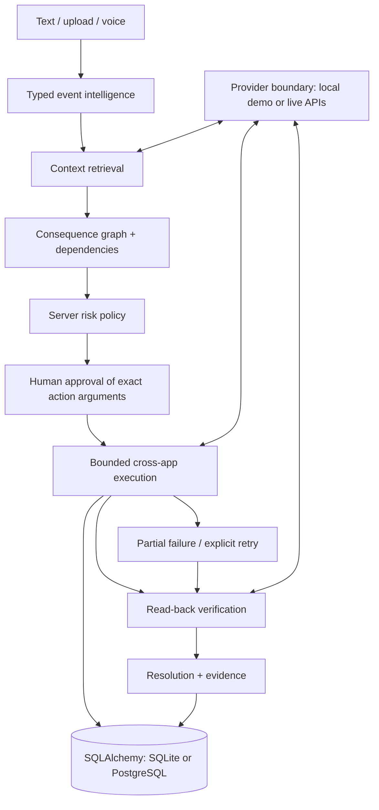
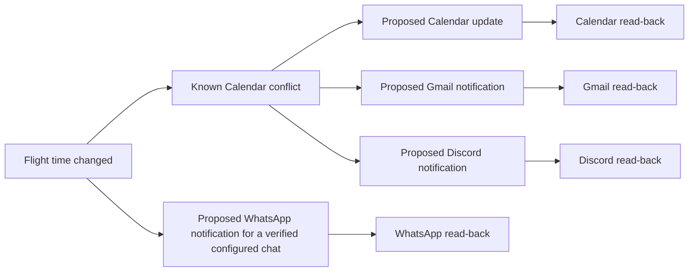

# LIFEOS

> Something changed. LIFEOS handles what happens next.

A changed flight can affect a meeting and the people who need to know. LIFEOS finds known calendar and conversation targets, proposes changes, asks for approval, executes approved actions and reads back the result. It does not infer airport travel or pickup times.

This repository includes a React command center, a FastAPI service, durable application state, a Windows shell for the actual Discord and WhatsApp websites, provider adapters and deployment configuration. The default configuration is live mode with an empty workspace. A separate live Railway service is deployed, while the existing public demo retains labeled local records. **The live product is not yet fully accepted**; see [current release status](docs/RELEASE_STATUS.md). This is a single-owner deployment design, not a reviewed multitenant service.

The **My work** screen saves projects, goals, tasks, habits and notes in the owner database. Task completion updates linked goal/project progress; dated check-ins drive habit streaks; due dates and goal targets appear in a local agenda alongside Google Calendar events when connected. Activity and reminders come from saved changes, so a new live workspace shows empty states instead of invented statistics.

## Hosted live workspace

The password-protected live workspace is at **https://lifeos-live-production.up.railway.app**. It runs the current source against a separate persistent volume. Public browser login, an initially empty work screen, a saved task surviving a service restart, and deletion passed on 18 September 2026. Gmail, Calendar, Drive, Discord, and WhatsApp passed real hosted read checks while the Windows desktop app was connected. The existing Google grant works, but a new hosted OAuth callback still receives `redirect_uri_mismatch`. No complete Calendar → Discord → WhatsApp send/read-back has been accepted yet. See [release status](docs/RELEASE_STATUS.md) before presenting cross-provider execution as complete.

## Public demo

The password-protected demo is deployed at **https://lifeos-public-production.up.railway.app**. Ask the installation owner for the workspace password. It runs the flight and meeting workflows against persistent demo application records; the public installation is separate from the owner's live Google, Discord and WhatsApp accounts. The deployment and acceptance record is in [public demo release](docs/PUBLIC_DEMO_RELEASE.md).

## Verification

Current evidence and remaining live-provider blockers: [live acceptance](docs/LIVE_ACCEPTANCE_2026-09-17.md) and [release status](docs/RELEASE_STATUS.md). The current implementation includes opt-in [Gmail/Discord monitoring](docs/SOURCE_MONITORING.md), conditional [live Calendar update undo](docs/LIVE_UNDO.md), and [local data controls and measured usage](docs/PRIVACY_AND_USAGE.md). Historical screenshots in the repository use isolated demo records and are not live-account proof.

## Architecture



The backend owns planning, risk, authorization and execution. Model output is typed input to that policy; it is not authority to invoke arbitrary tools. SQLAlchemy persists events, action arguments, approvals and audit data. React renders those records and sends authenticated, CSRF-protected commands. Vite proxies `/api` during development; the production image serves built frontend assets from FastAPI on the same origin.



Explicit orchestration keeps the approval boundary inspectable. Chained voice uses microphone capture → transcription → the same planning/approval path → speech synthesis. Realtime conversational streaming is not implemented. Approval requires an explicit command bound to a reviewed plan; an unbound “yes” never authorizes an application mutation.

## Run locally

Requirements: Python 3.11+ (CI/container use 3.12), Node.js 22, npm. Run from the repository root.

```powershell
python -m venv .venv
.venv\Scripts\python -m pip install --upgrade pip==26.2.1
.venv\Scripts\python -m pip install -e ".[dev]"
Copy-Item .env.example .env
# Set LIFEOS_AUTH_PASSWORD (16+ characters) and a generated LIFEOS_ENCRYPTION_KEY in .env.
.venv\Scripts\python -m lifeos.migrate
.venv\Scripts\python -m uvicorn lifeos.main:app --host 127.0.0.1 --port 8010
```

In another terminal:

```powershell
cd frontend
npm ci
npm run dev -- --host 127.0.0.1
```

Open `http://127.0.0.1:5173`. The development frontend proxies to API port 8010; set `LIFEOS_API_URL` when using another backend URL. On macOS/Linux replace `.venv\Scripts\python` with `.venv/bin/python` and copy the environment file with `cp .env.example .env`. The live workspace starts empty; connect authorized providers before expecting an actionable cross-app plan. The database is stored in `data/`; restarting preserves it.

To serve the compiled frontend from the backend:

```powershell
npm --prefix frontend run build
$env:LIFEOS_STATIC_DIR = (Resolve-Path frontend/dist).Path
.venv\Scripts\python -m uvicorn lifeos.main:app --host 127.0.0.1 --port 8010
```

## Open the actual Discord and WhatsApp sites in LIFEOS

On Windows, launch the desktop window and sign in to the hosted live workspace:

```powershell
npm --prefix desktop ci
npm --prefix desktop start
```

The center of this window is the real LIFEOS, Discord, or WhatsApp Web page in an isolated persistent Electron session. Sign in to each site inside its own view; LIFEOS never copies provider website credentials into the backend. The right dock reads real LIFEOS events and lets the owner review and approve actions. A page-load badge only reports that the site rendered; it does not claim that its account is connected. The unsigned Windows companion installer built with `npm --prefix desktop run dist:win` opens the trusted hosted LIFEOS workspace by default; set `LIFEOS_DESKTOP_URL=http://127.0.0.1:8010/desktop.html` to use a local backend. When the desktop bridge is enabled, approved WhatsApp jobs use this same visible, signed-in view and return read-back to the backend; the separate Playwright profile remains an optional local alternative.

## Isolated legacy demo

Use `LIFEOS_MODE=demo` only in a separate test environment. Its local records are not connected accounts and do not count as live acceptance.

1. Start LIFEOS and click **Run Hero Demo**.
2. Inspect the local Gmail event and the discovered Calendar conflict.
3. Follow the consequence graph and inspect each action's target, arguments and risk.
4. Approve the intended actions. Editing an action invalidates its prior approval.
5. Execute the plan. Watch the timeline and application records change.
6. Inspect the read-back evidence and final status. Try the meeting scenario and reset for another run.

These are labeled local application records, not live third-party browser windows. Use simulation to inspect a plan before application. A resolved selected plan may contain visibly rejected actions alongside verified actions; rejection is never labeled successful execution. Failed or pending actions remain visible.

For a voice demo, configure `LIFEOS_OPENAI_API_KEY`, restart, allow microphone access on localhost or HTTPS, record the event, review the transcription and follow the same approval process. A spoken approval opens a preview bound to the current plan version and action IDs for 120 seconds. Inspect the previews, then record “confirm approval” or select **Confirm voice approval**. Record “execute approved plan” to execute that approved plan. A bare “yes” without a pending preview never approves anything. After execution, play the resolution summary and stop playback when needed. Speech output uses the configured OpenAI service. Network, account quota and device permission failures remain visible; text is always available. Browser tests use a synthetic microphone and mocked speech responses while exercising the real local planning/approval flow; physical capture and live OpenAI speech remain separate acceptance checks.

## Integrations and configuration

| Integration | Configured live path | Local demo |
|---|---|---|
| Gmail | Google OAuth; drafts/messages through Gmail API | Persistent message records |
| Google Calendar | Google OAuth; event updates and read-back | Persistent event records |
| Google Drive | Google OAuth; document/file access | Persistent document records |
| Discord | Bot token and explicit channel | Persistent channel records |
| WhatsApp | Signed-in desktop view bridge or opt-in Playwright worker; explicit contact | Persistent message records |
| OpenAI | Structured event extraction, transcription, speech | Deterministic local event handling without keys |

All backend settings use the `LIFEOS_` prefix. [.env.example](.env.example) lists the supported configuration. Secrets belong only on the server; never use a `VITE_` variable for a credential. `LIFEOS_MODE=demo` selects local providers; `live` selects configured provider operations. `LIFEOS_ENVIRONMENT=production` enables stricter startup requirements. Use a long unique owner password and a Fernet encryption key for live credentials. Flight plans do not calculate travel time or propose pickup times; check those manually. Optionally select a proposal with `LIFEOS_DRIVE_PROPOSAL_FILE_ID`; supported proposal content is Google Docs or text.

For Google OAuth, create a Web OAuth client in your Google Cloud project, configure the consent screen and test users, enable the Gmail, Calendar and Drive APIs, then register the exact callback from `LIFEOS_GOOGLE_REDIRECT_URI`. Set the client ID/secret and use **Connect Google** in Integrations. Local default: `http://localhost:8010/api/integrations/google/callback`. Use the same hostname throughout the browser session. Deployment callbacks must use your HTTPS hostname. Requested scopes are Gmail readonly/compose, Calendar events and Drive readonly; Drive live integration supplies context rather than document mutation. Provider scope verification and consent restrictions must be validated in your own Google project.

WhatsApp requires interactive sign-in inside the desktop view for the bridge, or in a dedicated browser profile for the optional local worker. Keep either session private. The application container does not install Chromium or expose a browser profile. Read [integration setup and supported operations](docs/INTEGRATIONS.md) and [deployment instructions](docs/DEPLOYMENT.md) before enabling it. Read access through the signed-in desktop view has passed locally; live sending still requires an approved action and delivery acceptance.

## Safety, approvals and evidence

The server ties approval to the event version and exact action arguments. Editing a target or payload requires fresh approval. Owner-scoped queries, session cookies, origin/CSRF checks and rate limits protect commands. Execution tracks per-action states and idempotency; retries must not silently duplicate completed actions. Dependency failures remain visible. Read-back verification is separate from a successful write response. Compensation can only undo supported reversible changes; a sent message cannot reliably be unsent.

The audit chain detects record changes when checked against its stored chain, but is not an externally anchored immutable ledger. Demo authentication is intentionally convenient for localhost and must not be exposed publicly. [Security model and residual risks](docs/SECURITY.md) documents these boundaries.

## Verification and performance

```powershell
.venv\Scripts\python -m ruff check backend tests scripts
.venv\Scripts\python -m mypy --strict backend/lifeos/policy.py backend/lifeos/schemas.py backend/lifeos/config.py
.venv\Scripts\python -m playwright install chromium
.venv\Scripts\python -m pytest -q
.venv\Scripts\python scripts/scan_secrets.py
.venv\Scripts\python -m pip_audit
npm --prefix frontend run lint
npm --prefix frontend run typecheck
npm --prefix frontend run build
npm --prefix frontend audit --audit-level=high
cd frontend
npx playwright install chromium
npm run test:e2e
```

Backend tests exercise the workflow and adversarial/state transitions; provider contract tests use HTTP fixtures. Browser tests exercise the running UI. Fixture success does not establish live integration success. CI executes these gates and builds the container; it does not publish automatically. Strict Python static typechecking covers the policy, schema and configuration modules; the dynamic persistence and orchestration modules are not yet included in that gate.

With a local demo API running, measure actual request timings:

```powershell
.venv\Scripts\python scripts/benchmark.py --url http://127.0.0.1:8010 --runs 5
```

This resets the current demo scenario and writes `docs/benchmark.json`. It records plan, approval and execution/read-back wall times; excludes human deliberation, live services and voice. It refuses live mode. [Local deployment and performance evidence](docs/DEPLOYMENT_VERIFICATION.md) includes actual SQLite and PostgreSQL samples, container readiness and restart persistence. No latency claim should be extrapolated from local timings to provider networks. `/api/metrics`, event timelines and `/api/audit` expose operational evidence. `/health` and `/ready` support deployment probes.

## Deployment and troubleshooting

See [Deployment](docs/DEPLOYMENT.md) for Docker Compose, PostgreSQL, HTTPS, backups, live-mode setup and the release checklist. The separate Railway live service is deployed, but Google owner consent, hosted WhatsApp delivery and full cross-provider acceptance remain open.

| Symptom | Check |
|---|---|
| API unavailable | Backend terminal, port 8010 for development or 8000 for Compose, `/health`, `/ready` |
| CSRF/origin error | Keep localhost/127.0.0.1 consistent; set the exact frontend origin in `LIFEOS_ALLOWED_ORIGINS` |
| Empty integrations or disabled voice | Mode, server-side credentials, process restart |
| Approval becomes stale | Reload event and review changed arguments before approving again |
| Database permission failure | Writable `data/` directory or PostgreSQL URL/credentials |
| OAuth callback failure | Exact callback, consent/test users, matching browser hostname |
| Partial execution | Inspect failed action evidence; resolve cause; retry explicitly |
| Microphone unavailable | HTTPS/localhost, browser permission, device selection; use text input |

## Tradeoffs and next work

The first deployment uses one backend worker because orchestration coordination is process-local. Local demo apps make verification reproducible without credentials, but do not replace third-party acceptance testing. Live planning depends on connected calendar timing, contacts and configured route addresses; insufficient context requests clarification instead of inventing travel times. Provider authorization, WhatsApp DOM changes, external rate limits and microphone permissions are outside unit-test guarantees. Source monitoring is limited to opt-in bounded Gmail/Discord polling; there is no general autonomous browser agent or streaming Realtime voice mode. Before public multi-user operation, add an identity provider, distributed execution leases/queue, stronger tenant isolation, external audit anchoring and an independent security review. [Original requirements](docs/REQUIREMENTS.md) and [implementation plan](docs/IMPLEMENTATION_PLAN.md) preserve the intended scope; implemented features and externally blocked checks must be reported separately.

DM Sans and Manrope are bundled locally with their [DM Sans license](frontend/public/fonts/DM-Sans-OFL.txt) and [Manrope license](frontend/public/fonts/Manrope-OFL.txt). The dashboard does not require a runtime font-service connection.
