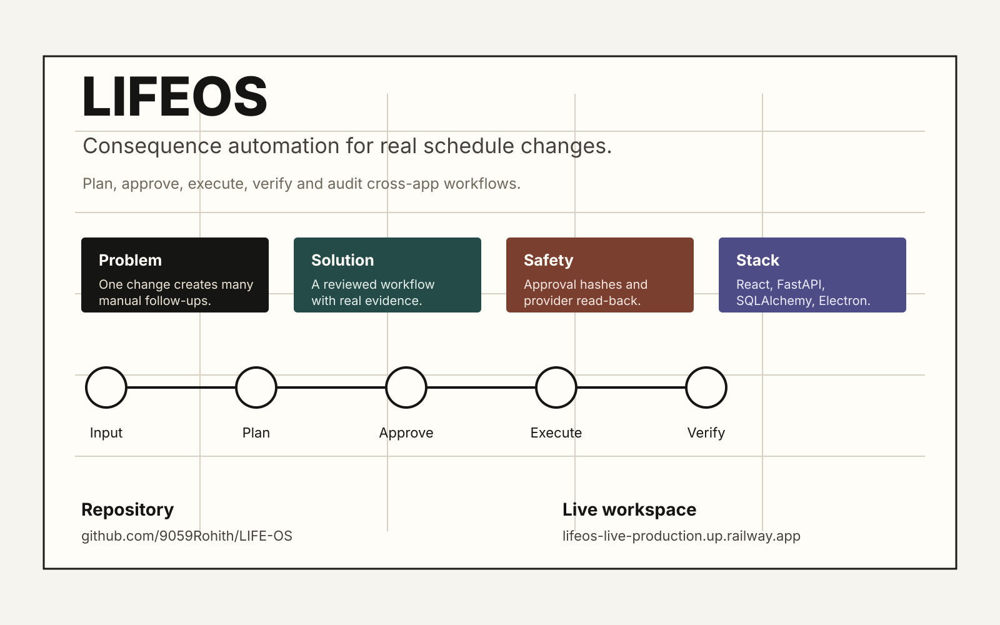
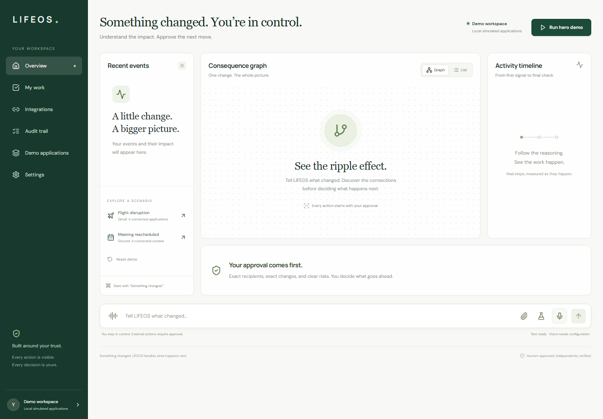
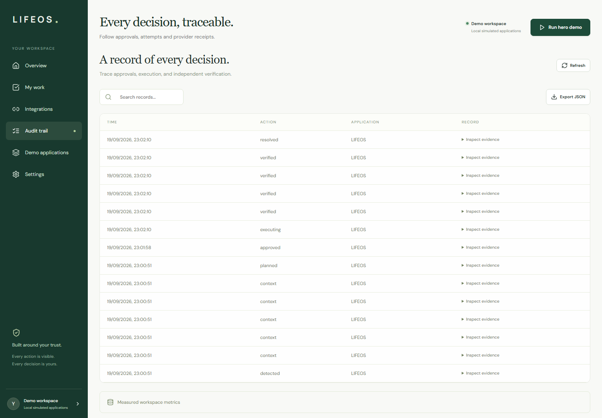
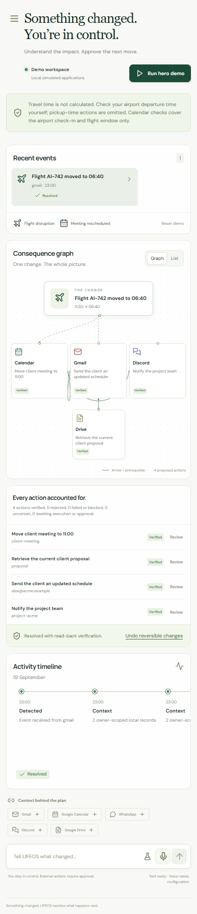

# LIFE-OS

> A consequence-aware operating system for changes that move across your digital life.

LIFE-OS turns a real-world change into a structured, approval-bound workflow across the applications that need to respond. It gathers context, builds an action graph, waits for human approval, executes bounded provider actions, verifies the result by reading providers back, and preserves the evidence in an audit trail.

  

  <a href="https://lifeos-live-production.up.railway.app"><strong>Live workspace</strong></a>
  &nbsp;&middot;&nbsp;
  <a href="https://github.com/9059Rohith/LIFE-OS/blob/main/docs/demo/lifeos-demo-final.webm"><strong>Demo video</strong></a>
  &nbsp;&middot;&nbsp;
  <a href="ARCHITECTURE.md"><strong>Architecture</strong></a>
  &nbsp;&middot;&nbsp;
  <a href="https://github.com/9059Rohith/LIFE-OS"><strong>Source code</strong></a>

  
  
  

## Evaluate it in 3 minutes

1. **Open** the [live workspace](https://lifeos-live-production.up.railway.app) and choose **Try interactive demo** for isolated sample data, or sign in for the protected owner workspace.
2. **Watch** the [repository demo video](https://github.com/9059Rohith/LIFE-OS/blob/main/docs/demo/lifeos-demo-final.webm).
3. **Inspect** the [dashboard](docs/screenshots/01-dashboard.png), [workflow plan](docs/screenshots/02-workflow-plan.png), and [verified result](docs/screenshots/03-verified-result.png).
4. **Read** the [architecture](ARCHITECTURE.md), [AI boundary](AI_USAGE.md), and [security model](SECURITY.md).
5. **Run** the project locally using the setup below.

## The core workflow

~~~text
Change detected
      |
      v
Context gathered from authorized providers
      |
      v
Typed consequence plan and dependency graph
      |
      v
Human reviews exact actions and arguments
      |
      v
Bounded execution with idempotency and retries
      |
      v
Provider read-back, evidence, and audit history
~~~

The product is deliberately narrower than a general autonomous office agent. Its strength is a controlled, demonstrable workflow for schedule changes and their cross-application consequences.

## What is implemented

- Natural-language event intake through text, upload, voice, or connected application screens.
- Deterministic event extraction with constrained OpenAI-compatible structured extraction when live mode needs help.
- Context gathering from Google services, Discord, WhatsApp, and stored work records behind provider boundaries.
- A consequence graph showing dependencies, action status, approval requirements, and execution progress.
- Approval-bound actions whose exact arguments and event version are hashed; editing an action invalidates its approval.
- Bounded execution with owner locks, idempotency keys, provider preflight checks, retries, compensation, and explicit uncertain states.
- Independent provider read-back before an action is marked verified.
- Tamper-evident audit entries with inspectable evidence.
- My Work for projects, goals, tasks, habits, notes, reminders, agenda items, and activity history.
- Responsive React web UI plus a Windows Electron companion for real Discord and WhatsApp web sessions.
- Light/dark UI modes and motion-aware workflow visualization.

## Product screenshots

## Demo

The repository contains a 3:59 application demo artifact with video, audio narration, and timed subtitles:

- [Watch or download lifeos-demo-final.webm](docs/demo/lifeos-demo-final.webm)
- [Read the demo script](docs/demo-script.md)
- [Read the subtitle track](docs/demo/lifeos-demo.srt)
- [Read the voiceover text](docs/demo/lifeos-demo-voiceover.txt)

The GitHub-hosted file is the verified repository artifact. If a submission form requires a streaming-host URL, upload this same file to the permitted host rather than inventing a link.

## How the system works

### Understand

The user describes what changed. LIFE-OS accepts a narrow set of supported event shapes and uses AI only as a structured interpretation aid when deterministic parsing is insufficient.

### Gather context

The provider boundary reads only authorized, relevant information. Provider output is treated as untrusted context, not as permission to act.

### Plan

The engine creates typed actions, dependencies, risk labels, approval requirements, and an event version. The frontend renders this as a graph and review queue.

### Approve

The person reviews action arguments. Approvals are bound to the event version and argument hash, so a changed plan cannot reuse an earlier approval.

### Execute

The engine uses allowlisted provider operations, idempotency keys, bounded retries, owner locking, and explicit failure states. High-impact actions remain approval-gated.

### Verify

LIFE-OS reads provider state back independently. The final outcome, receipts, uncertain deliveries, compensation attempts, and audit history remain visible.

## Architecture

~~~mermaid
flowchart TD
    U[User] --> UI[React command center]
    UI --> API[FastAPI API]
    API --> SEC[Auth, CSRF, origin and rate limits]
    SEC --> ENG[Workflow engine]
    ENG --> PLAN[Typed extraction and planner]
    PLAN --> CTX[Provider context boundary]
    CTX --> POLICY[Risk policy and approval hashes]
    POLICY --> EXEC[Bounded execution state machine]
    EXEC --> VERIFY[Provider read-back verification]
    VERIFY --> AUDIT[Audit chain and evidence]
    AUDIT --> DB[(SQLite or PostgreSQL)]
    EXEC --> PROVIDERS[Google, Discord, WhatsApp and work APIs]
~~~

The production image builds the React frontend and serves it from FastAPI on the same origin. SQLite supports a single-process hosted workspace; PostgreSQL is supported through Docker Compose. See [ARCHITECTURE.md](ARCHITECTURE.md).

## AI and agent boundary

LIFE-OS is not a general-purpose agent with arbitrary tool access. That is deliberate.

AI helps extract a supported event, date, and time from natural language. The server then re-parses and validates the result, constructs supported actions itself, checks provider permissions, and requires human approval before high-impact writes. AI output is never executable authority.

Supported action families include:

- Calendar updates and rescheduling plans.
- Gmail notifications.
- Discord notifications.
- WhatsApp notifications through the connected desktop bridge.
- Explicit work-record operations.

Read [AI_USAGE.md](AI_USAGE.md) for models, validation, failure handling, and limitations.

## Integrations

| Integration | Role | Boundary |
| --- | --- | --- |
| Google Gmail | Read mail context and prepare notifications. | Owner-scoped OAuth grant and provider checks. |
| Google Calendar | Read events, check availability, and plan supported changes. | Exact-event planning, approval, idempotency, and read-back. |
| Google Drive | Surface authorized proposal or supporting document context. | Optional configured file access. |
| Discord | Read channel context and send approved notifications. | Configured channel allowlist and provider evidence. |
| WhatsApp | Read and send through the signed-in desktop companion. | Isolated browser view, explicit bridge job, exact-message read-back. |
| Work records | Persist personal work and activity. | Owner-scoped routes and deletion/export controls. |

Integration availability depends on credentials, provider permissions, and whether the Windows companion is connected. The UI reports those states instead of presenting unavailable services as connected.

## Security and reliability

- HttpOnly, SameSite session cookies and CSRF tokens for mutations.
- Browser origin validation, request body limits, voice admission budgets, and rate limits.
- Primary-owner enforcement for live provider actions.
- Password hashing for optional secondary workspaces.
- Encrypted provider credentials when LIFEOS_ENCRYPTION_KEY is configured.
- Pydantic validation and explicit allowlisted provider operations.
- Approval hashes tied to exact arguments and plan versions.
- Idempotency keys, bounded retries, owner locks, and crash-to-uncertain recovery.
- Read-back verification before resolution and manual review for uncertain deliveries.
- Tamper-evident audit history and /health plus /ready endpoints.

LIFE-OS is not presented as a penetration-tested multi-tenant SaaS. The supported hosted boundary is primary-owner and single-worker focused. See [SECURITY.md](SECURITY.md), [docs/SECURITY.md](docs/SECURITY.md), and [docs/RELEASE_STATUS.md](docs/RELEASE_STATUS.md).

## Technology stack

| Layer | Implementation |
| --- | --- |
| Web UI | React, TypeScript, Vite, Lucide icons, responsive CSS |
| API | Python 3.11+, FastAPI, Uvicorn, Pydantic |
| Workflow engine | Typed event planning, approval state machine, idempotent provider execution |
| Persistence | SQLAlchemy-backed SQLite or PostgreSQL, startup migrations |
| AI | OpenAI-compatible structured extraction and optional voice services |
| Desktop | Electron with isolated Discord and WhatsApp views plus a signed-in bridge queue |
| Delivery | Docker, Railway configuration, same-origin static frontend serving |
| Quality | Pytest, Playwright, ESLint, Ruff, mypy, pip-audit, npm audit, secret scanning |

## Local development

### Prerequisites

- Python 3.11 or newer
- Node.js 18 or newer
- Git

### Clone and configure

~~~bash
git clone https://github.com/9059Rohith/LIFE-OS.git
cd LIFE-OS
copy .env.example .env
~~~

On macOS or Linux, use cp .env.example .env instead.

Set a strong LIFEOS_AUTH_PASSWORD, keep LIFEOS_MODE=live, and use the SQLite database path from .env.example. Provider credentials are optional until you exercise a specific integration.

### Start the API

~~~bash
python -m venv .venv
python -m pip install -e ".[dev]"
python -m uvicorn lifeos.main:app --app-dir backend --host 127.0.0.1 --port 8010 --reload
~~~

### Start the frontend

In a second terminal:

~~~bash
cd frontend
npm ci
LIFEOS_API_URL=http://127.0.0.1:8010 npm run dev -- --port 5173
~~~

On PowerShell:

~~~powershell
$env:LIFEOS_API_URL = "http://127.0.0.1:8010"
npm ci
npm run dev -- --port 5173
~~~

Open http://127.0.0.1:5173 and sign in with the local workspace password.

### Desktop companion

The Electron companion is optional and is needed for the live WhatsApp and Discord web sessions:

~~~bash
cd desktop
npm ci
npm test
npm start
~~~

Read [docs/DEPLOYMENT.md](docs/DEPLOYMENT.md) and [docs/LOCAL_LIVE.md](docs/LOCAL_LIVE.md) before connecting real provider accounts.

## Environment variables

The complete safe template is [.env.example](.env.example). Important variables include:

| Variable | Purpose |
| --- | --- |
| LIFEOS_AUTH_PASSWORD | Required protected owner-workspace login secret. |
| LIFEOS_DEMO_BUTTON | Enables the isolated demo entry button; demo sessions never receive live provider access. |
| LIFEOS_DATABASE_URL | SQLite or PostgreSQL connection URL. |
| LIFEOS_ALLOWED_ORIGINS | Browser origins allowed to call the API. |
| LIFEOS_ENCRYPTION_KEY | Encrypts provider credentials at rest when configured. |
| LIFEOS_OPENAI_API_KEY | Optional structured extraction and voice services. |
| LIFEOS_GOOGLE_* | Optional Google OAuth configuration. |
| LIFEOS_DISCORD_* | Optional Discord bot and destination configuration. |
| LIFEOS_WHATSAPP_* | Optional desktop bridge configuration. |

Never commit .env, tokens, provider profiles, database backups, or browser session files.

## Testing and verification

Current frontend verification for the UI release:

~~~text
npm run typecheck       passed
npm run lint            passed
npm run build           passed
npm run test:e2e        15 passed, 1 skipped
~~~

The [final release report](docs/FINAL_RELEASE_REPORT.md) records broader release evidence, including 140 backend tests, security and dependency scans, desktop tests, Docker checks, hosted health/readiness checks, and the recorded Calendar -> Discord -> WhatsApp acceptance workflow.

Useful commands:

~~~bash
python -m pytest -q
python -m ruff check backend tests scripts
python -m mypy --strict backend/lifeos/policy.py backend/lifeos/schemas.py backend/lifeos/config.py
npm --prefix frontend run lint
npm --prefix frontend run build
npm --prefix desktop test
python scripts/scan_secrets.py
~~~

## Deployment

The current live workspace is:

https://lifeos-live-production.up.railway.app

The owner workspace is password-protected. When `LIFEOS_DEMO_BUTTON=true`, visitors can enter an isolated local-data demo without credentials; that session cannot access owner records or live provider adapters. The container exposes /health and /ready, builds the frontend in a pinned Node stage, and serves the compiled assets from FastAPI. Railway settings live in [railway.json](railway.json); container details are in [Dockerfile](Dockerfile).

Deployment caveats are documented rather than hidden: the supported hosted boundary is single-worker and primary-owner focused, the Windows installer is unsigned, and managed external backup scheduling is not claimed as a universal production guarantee. See [docs/RELEASE_STATUS.md](docs/RELEASE_STATUS.md).

## Repository map

~~~text
LIFE-OS/
|-- frontend/       React command center, components, styles, Playwright tests
|-- backend/        FastAPI routes, workflow engine, providers, security, storage
|-- desktop/        Electron companion and provider bridge
|-- tests/          Backend, provider, recovery, security, and integration tests
|-- docs/           Architecture, release evidence, screenshots, poster, demo assets
|-- scripts/        Verification, capture, recovery, packaging, and deployment helpers
|-- Dockerfile      Multi-stage production image
|-- docker-compose.yml
|-- .env.example    Safe configuration template
|-- ARCHITECTURE.md
|-- AI_USAGE.md
|-- SECURITY.md
|-- README.md
~~~

## Hackathon fit: Next-Gen Productivity and Automation

| Track goal | LIFE-OS evidence |
| --- | --- |
| Automate repetitive work | One schedule change can prepare coordinated Calendar, Gmail, Discord, and WhatsApp actions. |
| Streamline workflows | A single reviewed plan replaces repeated context lookup, drafting, and coordination. |
| Organize information | Events, provider context, action evidence, work records, reminders, and audit history are surfaced together. |
| Move people faster | The product reduces manual coordination while keeping high-impact decisions visible and human-approved. |
| Use AI meaningfully | AI assists structured event interpretation inside a server-controlled boundary; it does not receive arbitrary execution authority. |
| Demonstrate reliability | Approval hashes, idempotency, read-back verification, uncertain states, and audit evidence make the workflow inspectable. |

See [docs/HACKATHON_ALIGNMENT.md](docs/HACKATHON_ALIGNMENT.md) and [docs/SCREENOPS_COMPARISON.md](docs/SCREENOPS_COMPARISON.md).

## Implementation status and limitations

### Implemented and documented

- Local live-mode workspace with owner-scoped persistence.
- Approval-bound planning and execution lifecycle.
- Provider context, action dependencies, read-back verification, and audit evidence.
- Google, Discord, WhatsApp, Drive, voice, work-record, and desktop integration boundaries.
- Responsive web UI, optional dark mode, and Electron companion.
- Automated backend, frontend, desktop, security, recovery, build, and dependency checks.

### Boundaries to understand

- The product is optimized for a narrow class of schedule-change and consequence workflows.
- Provider actions require valid credentials, configured destinations, permissions, and in some cases the connected Windows companion.
- The hosted deployment is not positioned as a horizontally scaled, multi-tenant SaaS.
- The Windows installer is unsigned on the current release line.
- External submission platforms may require the repository demo video to be uploaded to a streaming host.

## Documentation

- [Architecture](ARCHITECTURE.md)
- [AI usage and model boundary](AI_USAGE.md)
- [Security policy](SECURITY.md)
- [Detailed security model](docs/SECURITY.md)
- [Deployment guide](docs/DEPLOYMENT.md)
- [Local live setup](docs/LOCAL_LIVE.md)
- [Hackathon alignment](docs/HACKATHON_ALIGNMENT.md)
- [Release status](docs/RELEASE_STATUS.md)
- [Final release report](docs/FINAL_RELEASE_REPORT.md)
- [Demo script](docs/demo-script.md)
- [Contributing](CONTRIBUTING.md)

## Contributing

~~~bash
git checkout -b feature/your-change
git status
python -m pytest -q
npm --prefix frontend run lint
npm --prefix frontend run build
~~~

Keep changes scoped, avoid committing secrets, and describe verification evidence in the pull request. See [CONTRIBUTING.md](CONTRIBUTING.md).

## License

LIFE-OS is released under the [MIT License](LICENSE).

## Project links

- Repository: https://github.com/9059Rohith/LIFE-OS
- Live workspace: https://lifeos-live-production.up.railway.app
- Demo artifact: https://github.com/9059Rohith/LIFE-OS/blob/main/docs/demo/lifeos-demo-final.webm
- Poster: [docs/poster/lifeos-poster.svg](docs/poster/lifeos-poster.svg)
- Screenshots: [docs/screenshots](docs/screenshots)
